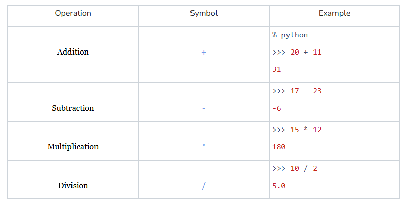
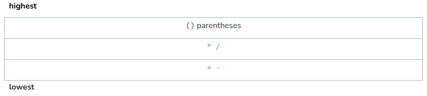
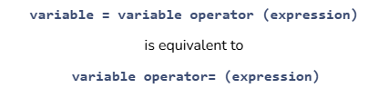

# <center> Basic Arithmetic </center>

## Quest 

For the last five sections, we have been in Computer Science class getting well acquainted with coding in Python. For this section, we are going to take a brief detour to Math class (but still in Python) to talk about how to do some basic mathematical operations in Python. \
By the end of this section, you should be able to do the four most simple operations -- addition, subtraction, multiplication, and division -- and understand the order of those operations. You should also understand the difference between an integer and a float, how to convert between the two, and how to account for conversion loss. 

## Int and Float
Before we dive into these concepts, let’s begin with a brief reminder from the **variables** section. If you remember, in that section, we briefly defined int and float as follows:  

* An **int** is a number without a decimal point or a whole integer number. 

* A **float** is a number with a decimal point (including numbers with 0 after the decimal point such as 2.0). This will be useful to remember for the following concepts.

## Python Arithmetic 

The table below shows how to do some of the most basic operations in Python using examples from the REPL: 



An important thing to note: dividing by zero will result in a <span style="color: #b85353"> ZeroDivisionError  </span> : 

```python
% python
>>> 6 / 0 
Traceback (most recent call last):
  File "<stdin>", line 1, in <module>
ZeroDivisionError: division by zero
```

## Type Conversion

Aside from errors, one thing that you may have noticed in the table is that using the / symbol will result in a float result (even if both of the arguments are integers). This is called **implicit type conversion**. \
This shows up a lot in Python. That was an operation between two integers, but any operation between an int and a float will also result in a `float`: 

```python
def main(): 
    x = 80 + 16.0
    y = 30.0 - 37
    z = 41 * 82.0
    print(x)
    print(y)
    print(z)

if __name__ == '__main__':
    main()
```

#### Output
```
96.0
-7.0
3362.0
```

---
Fortunately, in Python, we do not need to worry about the distinction between floats and ints too much, but it is a good thing to know if you want whole numbers but are getting decimals. \
A distinction that we do need to worry about however is `strings` vs `ints` and `floats`. If you use the plus sign operator ‘`+`’ between two strings, even if the two `strings` are numbers (ex. ‘<span style="color: #64c46c"> 15 </span> ’), Python does not treat them like `ints` or `floats`. When using `+` between two strings, Python **concatenates** them. Consider the example below: 

```python
def main(): 
    x = '80' + '16.0'
    print(x)

if __name__ == '__main__':
    main()
```

#### Output
```
8016.0
```

---

Instead of adding the two numbers, Python essentially glues the two strings together to form one string. This works with non-numbers too. 

```python
def main(): 
    x = 'Hello'
    y = 'Python'
    print(x + ' ' + y)

if __name__ == '__main__':
	main()
```

#### Output
```
Hello Python
```

Notice how we have to add a space between the two strings. Otherwise, we would have gotten  <span style="color: #64c46c"> ‘HelloPython’ </span>  which isn’t quite right. \
If you read the optional section in `Print` on printing with multiple arguments, you might note that this is slightly different from the <span style="color: #0d3b8f"> print </span> function which automatically adds a space between the arguments. 

Another important thing to note is that Python does not have implicit type conversion between strings and numbers. Trying to add or concatenate a string and an int or float will lead to an <span style="color: #c91a1a"> error </span>:

```python
def main(): 
    x = '80' + 16.0
    print(x)

if __name__ == '__main__':
    main()
```

#### Output
```
TypeError: can only concatenate str (not "float”) to str
```

---
Thankfully, there is **explicit type conversion**. This is accomplished by simply passing a value through the desired **conversion function**, such as  <span style="color: #d14fd1"> int( ), float( ), or str( ) </span> .

```python
def main(): 
    x = int('34') + 17.0
    y = 19 + int(float('5.0'))
    print(x)
    print(y)

if __name__ == '__main__':
    main()
```

#### Output
```
51.0
24
```

The conversion functions only do one conversion at a time. You can’t call the `int()` 1 function on a string that has a decimal point. You have to convert the `string` to a `float` first and then an `int`. 

---
Also, it is important to note that the `int()` function simply chops off anything after the decimal. No rounding is involved. \
This can be dangerous. If we convert a float to an int and then back again, we might lose information. This is called **conversion loss**.

```python
def main(): 
    x = 3.625
    y = int(x)
    print(float(y))

if __name__ == '__main__':
    main()
```

#### Output
```
3.0
```

As we can see when we run it, the <span style="color: #c74f4f"> .625  </span> is lost as a result of calling the `int()` function.

## Order of Operations (so far)
The precedence of operators or order of operations up until this point is as follows:



We will add to this list of precedence in the **conditionals** and **advanced arithmetic** sections. For now, let’s focus on the three that we have filled. \
As you can see in the figure above, parentheses are evaluated first, followed by multiplication and division, and then addition and subtraction. When two operations have the same precedence and are on the same line (and not separated by parentheses) the order of precedence is left to right with the leftmost operator being evaluated first: 

```python
% python
>>> 30 / 3 * 5
50.0
```
In this way, Python follows the typical order of operations found in regular math. 

Now let’s see some more examples. Swipe through these slides to see some examples of how expressions are evaluated and maybe try to answer a few on your own before clicking to the answer slide:

## Assigning Expressions to Variables
In the **variables section**, we showed you how to store things like `ints` and `floats` in a variable using the assignment operator with a simple statement like  <span style="color: #944f94"> x = 1068 </span> . The cool thing about Python is that we can also store expressions in variables. This is particularly useful when doing operations between two variables. 

```python
def main(): 
    x = 99
    y = 70
    z = x - y
    print(z)

if __name__ == '__main__':
    main()
```

### Output
```
29
```

In this line `z = x - y`, `z` is being set equal to the **values** represented by `x` and `y`. It is essentially receiving a copy. Therefore, if we update `x` or `y`, the value stored in `z` does not change: 

```python
def main(): 
    x = 99
    y = 70
    z = x - y
    x = 37
    print(z)

if __name__ == '__main__':
    main()
```

### Output
```
29
```

---
We can even do this without upsetting the program:

```python
def main(): 
    x = 99
    y = 70
    z = x - y
    x = z - x
    print(x)

if __name__ == '__main__':
    main()
```

### Output
```
-70
```

In the above example, `z` is set equal to `x - y` or  <span style="color: #c04242"> 99 </span> - <span style="color: #c04242"> 70 </span> which equals <span style="color: #c04242"> 29 </span>. Then `x` is updated to equal `z - x` or  <span style="color: #c04242"> 29 </span> - <span style="color: #c04242"> 99 </span> which equals <span style="color: #c04242"> -70 </span>. \
`z` is unaffected by that line because the assignment to z is not a formula that Python has to follow but a one-time assignment of the value. 

Another way to put it is that the expression on the right-hand side of the equals sign is evaluated first and then assigned to `z`. The variable never knows what operations it took to get to the value it is assigned. It only knows its value. 

## Operation Shortcuts

As you have seen in many examples in this section, we can update a variable’s value by using that same variable’s name. 

```python
def main(): 
    x = 7
    x = x + 1
    print(x)

if __name__ == '__main__':
    main()
```

#### Output
```
8
```

There are many cases in which we want to do something like this (such as incrementing a counter). Because of this, Python has a built-in shortcut to write such a statement.\
If we want to say `x = x + 3` we can simply write `x += 3`. This is true for all of the operations we have learned about in this section. As a general rule: 



Here are more examples below: 

```python
def main(): 
   x = 15
   x += 6	# same as x = x + 6     (x = 21)
   x -= 10	# same as x = x - 10    (x = 11)
   x *= 8	# same as x = x * 8     (x = 88)
   x /= 4	# same as x = x / 4
   print(x)

if __name__ == '__main__':
	main()
```

#### Output
```
22.0
```

---
In order to do this, x has to have already been assigned a value. If we try to do these statements (even the longhand version) before x has been assigned a value, we will get an  <span style="color: #c52a37"> error </span>:

```python
$ python
>>> x += 1
Traceback (most recent call last):
  File "<stdin>", line 1, in <module>
NameError: name 'x' is not defined 
```
