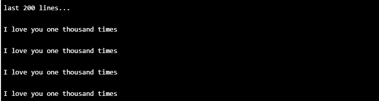

# <center> Nested Loops </center>

## Quest

Many programs use loops to repeat an instruction multiple times, but some programs need to repeat the loop itself – **they loop over the loop!** Amazing things can happen when we realize that a loop repeats any block of code, including another loop! Sometimes, by simply using the tools you already have in a new way, you can unlock a whole new skill you didn’t know you had! If you can believe it, the next section won’t cover any new keywords, and yet you will still walk away with a new programming skill. Don’t believe me? Let’s see below!


## Nested For Loops
What do you think this code does?

```python
def main():
	for i in range(5):
		for j in range(10):
			print("Hello, World!")

if __name__ == "__main__":
	main()
```

### Output 
<details>
<summary><b> Answer </b></summary>

```
Hello, World!
Hello, World!
Hello, World!
Hello, World!
Hello, World!
Hello, World!
Hello, World!
Hello, World!
Hello, World!
Hello, World!
Hello, World!
Hello, World!
Hello, World!
Hello, World!
Hello, World!
Hello, World!
Hello, World!
Hello, World!
Hello, World!
Hello, World!
Hello, World!
Hello, World!
Hello, World!
Hello, World!
Hello, World!
Hello, World!
Hello, World!
Hello, World!
Hello, World!
Hello, World!
Hello, World!
Hello, World!
Hello, World!
Hello, World!
Hello, World!
Hello, World!
Hello, World!
Hello, World!
Hello, World!
Hello, World!
Hello, World!
Hello, World!
Hello, World!
Hello, World!
Hello, World!
Hello, World!
Hello, World!
Hello, World!
Hello, World!
Hello, World!
```
</details>

---

A for-loop *inside* a for-loop? How strange! But if we read this code carefully, we should be able to figure out what it does…


The first loop is going to repeat whatever is inside 5 times. However, the stuff inside is another loop! This inner loop prints <span style="color:lightgreen">Hello, World!</span> 10 times. So, translating this into words, the function goes something like this:

* Do the following 5 times
    * Print <span style="color:lightgreen">Hello, World!</span> 10 times

You have just discovered **nested loops.**

We called them nested loops because one is inside the other. Nested loops are great if you have a task you want to repeat, but you also want to repeat the process of repeating that task. Confused? Don't worry, for now, we are going to keep the examples pretty simple to get you familiar with using nested loops, but you’ll come to see that this way of programming becomes much more useful when we talk about more advanced topics like graphics. Stay tuned!

## Nesting For and While Loops: 

As we said, loops don’t really care what they are repeating. You are free to nest for-loops inside while-loops and vice versa. Also, very important, the inner loop doesn’t have to be the only thing inside the outer loop.

```python
def main():
    number = 10
    while (number >= 1):
        print("I'm going to count to three!")
        for i in range(3):
            # Remember range() starts at 0
            print(i + 1)
        number -= 1


if __name__ == "__main__":
    main()
```

### Output 
<details>
<summary><b> Answer </b></summary>

```
I'm going to count to three!
1
2
3
I'm going to count to three!
1
2
3
I'm going to count to three!
1
2
3
I'm going to count to three!
1
2
3
I'm going to count to three!
1
2
3
I'm going to count to three!
1
2
3
I'm going to count to three!
1
2
3
I'm going to count to three!
1
2
3
I'm going to count to three!
1
2
3
I'm going to count to three!
1
2
3
```
</details>

Did you notice the following line in the previous example:

```python
print("I'm going to count to three!")
```

We placed this line *inside* the outer loop but *outside* the inner loop (Say that *ten* times fast!) When using a nested loop, you need to be careful where the repeated code is placed. This is because code within the inner loop runs more often than code that's just in the outer loop. What would happen if we moved that print statement inside the inner loop? Watch what happens when we move that print statement inside the inner loop and see what happens!

*Seriously… give it a go!*

```python
def main():
    number = 10
    while (number >= 1):
        for i in range(3):
            print("I'm going to count to three!")
            # Remember range() starts at 0
            print(i + 1)
        number -= 2


if __name__ == "__main__":
    main()
```

### Output 
<details>
<summary><b> Answer </b></summary>

```
I'm going to count to three!
1
I'm going to count to three!
2
I'm going to count to three!
3
I'm going to count to three!
1
I'm going to count to three!
2
I'm going to count to three!
3
I'm going to count to three!
1
I'm going to count to three!
2
I'm going to count to three!
3
I'm going to count to three!
1
I'm going to count to three!
2
I'm going to count to three!
3
I'm going to count to three!
1
I'm going to count to three!
2
I'm going to count to three!
3
```
</details>

Wow, that's way too many prints! We only wanted "I'm going to count to three!" to print when we begin a new count of three. Right now, it is running every single time we count off a new number. What might help is to think of the inner loop like a function and ask yourself whether the code you are adding to the loop should be a part of that function:

```python
# count_to_three() represents our inner loop, the part where we
# actually print the numbers
def count_to_three():
    for i in range(3):
        # Remember range() starts at 0
        print(i + 1)


def main():
    number = 10
    while (number >= 1):
        print("I'm going to count to three!") # This stays outside
        count_to_three()
        number -= 2


if __name__ == "__main__":
    main()
```

### Output 
<details>
<summary><b> Answer </b></summary>

```
I'm going to count to three!
1
2
3
I'm going to count to three!
1
2
3
I'm going to count to three!
1
2
3
I'm going to count to three!
1
2
3
I'm going to count to three!
1
2
3
```
</details>

Thinking about it this way, can you see why the print statement should stay outside the inner loop?

## Don't Reuse Loop Variables

It is common to use the variable `i` as the loop variable for a for-loop. When nesting for-loops inside each other, we need to pick a new variable name for the loop variable of the inner loop. Typically, programmers use `j` because it comes right after `i` in the alphabet:

```python
def main():
	for i in range(10):
		print("I'm going to count to three!")
		for j in range(3):
			print(j + 1)


if __name__ == "__main__":
	main()
```

### Output 
<details>
<summary><b> Answer </b></summary>

```
I'm going to count to three!
1
2
3
I'm going to count to three!
1
2
3
I'm going to count to three!
1
2
3
I'm going to count to three!
1
2
3
I'm going to count to three!
1
2
3
I'm going to count to three!
1
2
3
I'm going to count to three!
1
2
3
I'm going to count to three!
1
2
3
I'm going to count to three!
1
2
3
I'm going to count to three!
1
2
3
```
</details>


## Reusing Outer Variables

We can make use of the outer loop’s loop variable when writing the code for our inner loop. Take a second to think about how this is useful. We can write code for our inner loop that changes depending on which iteration of the outer loop we are on. Try to guess what this code does before you run it!

```python
def main():
	for i in range(10):
		for j in range(i+1):
			print(i,j)


if __name__ == "__main__":
	main()
```

### Output 
<details>
<summary><b> Answer </b></summary>

```
0 0
1 0
1 1
2 0
2 1
2 2
3 0
3 1
3 2
3 3
4 0
4 1
4 2
4 3
4 4
5 0
5 1
5 2
5 3
5 4
5 5
6 0
6 1
6 2
6 3
6 4
6 5
6 6
7 0
7 1
7 2
7 3
7 4
7 5
7 6
7 7
8 0
8 1
8 2
8 3
8 4
8 5
8 6
8 7
8 8
9 0
9 1
9 2
9 3
9 4
9 5
9 6
9 7
9 8
9 9
```
</details>

## Deeper Nesting

Nothing is stopping you from nesting another loop inside that inner loop. You can nest as many loops as you like, but be warned! As you nest more and more loops inside of each other, your program is going to get really long really fast. Even a triple-nested loop, while very literally a short amount of code, could take a huge amount of time to finish running. Again, by convention, the variable name for the loop variable of each loop is the letter after the previous nested loop:

```python
def main():
	for i in range(10):
		print("I love you ten times")

	for i in range(10):
		for j in range(10):
			print("I love you one hundred times")

	for i in range(10):
		for j in range(10):
			for k in range(10):
				print("I love you one thousand times")
	

if __name__ == "__main__":
	main()
```

## Output


