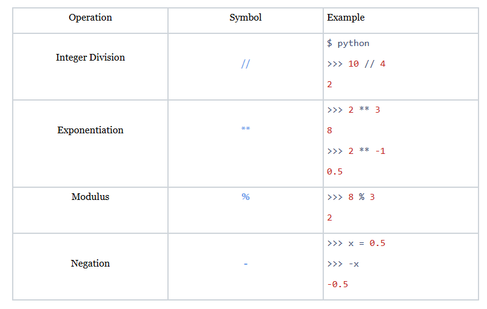
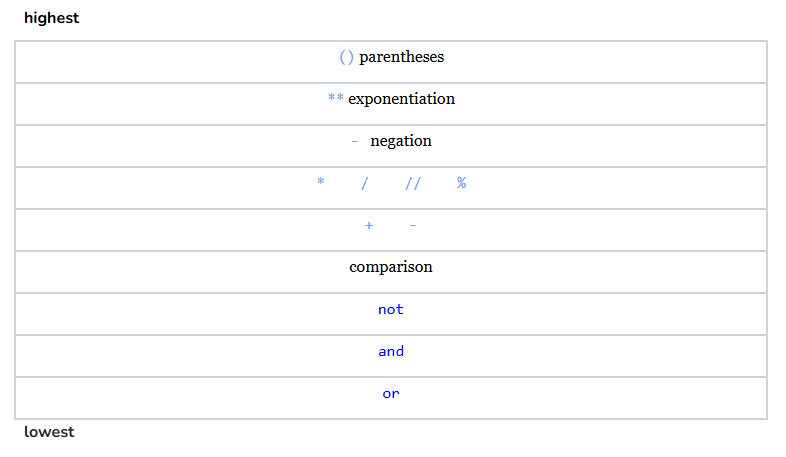
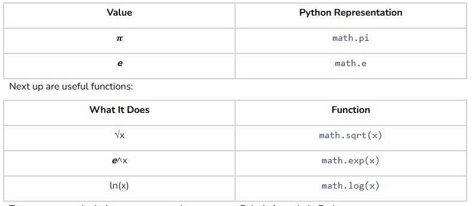
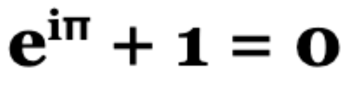
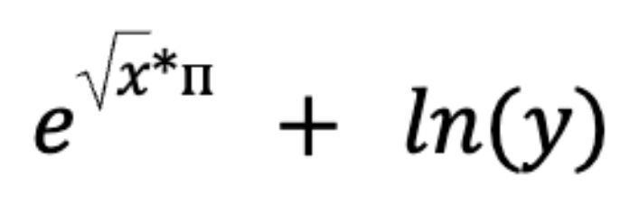

# <center> Advanced Arithmetic </center>

## Quest
Welcome to Math class Part 2! In this section, we will go over some of the more advanced operators in Python (including integer division, exponentiation, modulus, and unary negation) and give you a brief introduction to the Python Math class. 

## Advanced Arithmetic

The table below has the last four math operators that you will need to complete your mathematical tool belt. 



## Integer Division

As we saw in the Basic Arithmetic section, using the division symbol `/` in Python always results in a float value. If we want to drop the decimal, we can simply use the integer division operator `//`. This operator is the equivalent of calculating the division the normal way and then rounding down. 

```python
def main(): 
    x = 36 / 10
    y = 36 // 10
    print(x)
    print(y)

if __name__ == '__main__':
    main()
```

### Output

```
3.6
3
```

This means that integer division can also result in **conversion loss**. In the example above the 0.6 is completely lost information in the variable y. 

A few special cases to consider below: 

```python
def main(): 
    x = 36.0 // 10
    y = -5 // 2
    print(x)
    print(y)

if __name__ == '__main__':
    main()
```

### Output

```
3.0
-3
```

Because of the implicit type conversion that we discussed in the last section, using the `//` operator with a float will result in the float equivalent of the rounded number. This can be confusing because this is called **integer division**, but as a rule of thumb, **any** operation between an int and a float will result in a float. 

The second example is just meant to show what rounding down looks like for negative numbers. `-5 / 2` is `-2.5` and because integer division rounds down instead of truncating the value, the result is `-3` (since `-3` is less than `-2`).

## Exponentiation

As we can see in the table, the symbol for exponents is `**` and it supports negative exponents. The important thing to note is that negative exponents will give float values even if both arguments are ints. This is another example we’ve seen of **implicit** type conversion between two ints.  

## Modulus

The modulus operator gives you the remainder of a division between two numbers.

```python
def main(): 
    x = 39 % 17
    y = 12 % 4
    z = 18 % 19
    print(x)
    print(y)
    print(z)

if __name__ == '__main__':
    main()
```

### Output

```
5
0
18
```
If the second number is divided evenly into the first, the result will be 0. If the second number is larger than the first, the result will be the first number. 

Use the modulus operator when both numbers are positive and ints. Don’t worry about negative numbers or floats for now. 

Similar to dividing by 0, modulus or integer division by zero will result in a <span style="color:#FF0033">ZeroDivisionError </span>:

```python
% python
>>> 7 % 0 
Traceback (most recent call last):
  File "<stdin>", line 1, in <module>
ZeroDivisionError: integer division or modulo by zero
>>> 32 // 0
Traceback (most recent call last):
  File "<stdin>", line 1, in <module>
ZeroDivisionError: integer division or modulo by zero
```

## Unary Negation
As you may have noticed, the symbol for unary negation and the symbol for subtraction are the same. This symbol is called **unary** because it only acts on one thing. 

The expression to the right of the operator is negated (if it is positive, it becomes negative, and vice versa).  

```python
def main(): 
    x = - (19 - 7) # the 1st is negation, the 2nd is minus
    y = 23 - -4    # the 1st is minus, the 2nd is negation
    z = --8        # both negation
    print(x)
    print(y)
    print(z)

if __name__ == '__main__':
    main()
```

### Output

```
-12
27
8
```
As you can see in the last example, two unary negation signs cancel each other out. 

## Precedence

The figure below shows the final order of precedence table. 



As we mentioned before, operators of the same precedence are evaluated in order from left to right. Click through the slides to see some examples, and as always, try to figure out the answer before you click on the answer slide.

## Math Library

In addition to operators, Python also has a <span style="color:lightblue">Math</span>
 library to help with mathematical operations. First, we must import the library as usual:

```python
import math
```

The <span style="color:lightblue">Math</span> library has two important things that we are going to talk about: constants and functions. Some useful constants are listed below:  



To see an example, let’s say you wanted to represent Euler’s formula in Python:



*Note: i = √-1*

```python
import math

def main(): 
    ans = math.exp(math.sqrt(-1) * math.pi)
    ans += 1
    print(ans)

if __name__ == '__main__':
    main()
```

### Output

```
Value Error: math domain error
```

Uh oh! We’ve reached an error. Negative numbers are outside of the domain of square roots, so when we try to call `math.sqrt(-1)`, we get an error. The same is true for calling `math.log()` on zero or negative numbers. 

Domain rules apply the same in Python as they do in regular math. So, Euler’s formula is not going to work using what we’ve learned so far (we would need to talk about imaginary numbers in Python). Instead, let’s make a new formula. We’ll call it the... um... the Super Amazing formula: 



Let’s code this expression into Python and try plugging in some random numbers!

```python
import math
import random       # to give us random values for x and y

def main(): 
    x = random.randint(0, 10)       # must be a non-negative number
    y = random.randint(1, 10)       # must be a positive number
    ans = math.exp(math.sqrt(x) * math.pi)
    ans += math.log(y)
    print(ans)

if __name__ == '__main__':
    main()
```

### Output

```
537.6888801021008 
```

Ok, those are interesting numbers, but more importantly, we can now combine our skills of operators and the <span style="color:lightblue">Math</span> class in Python! Yay!!