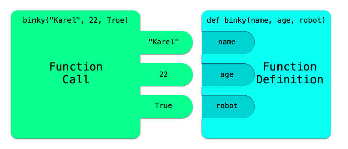

# <center> Anatomy of a Function</center>

## Quest

Functions are perhaps one of the most useful programming tools we have at our disposal. They allow us to significantly shorten our programs, turning a long block of code into a single, reusable instruction. Up until now, every function you have used has been written for you. That changes today! We are now going to learn how to build functions ourselves, empowering you to write as many functions as you like and build bigger and more complex programs.

## Function Call vs Function Definition

As of now, you only know how to **call** a function. A **function call** is what happens when your program runs an already defined function, like `print("hello")`. 

The thing about calling a function is you don’t actually need to know how it works, you just need to know what it does. You haven’t seen how `print` takes your message and writes it to the screen because all you really need to know is that it will!

There are a lot of built-in functions in Python that you can call, but not every task you want your computer to do has been written as a function yet. That’s where you come in! As the programmer, you can define additional functions that you want your program to use and then call those functions later on in the program when you need them. 

A **function definition** is exactly what it sounds like. It’s what we call the part of the code that defines what a new function is going to do when we call it.

## Parts of a Function

At the highest level, a function definition has three parts, a **header**, a **body**, and (optionally) a **return statement**. The header comes first, followed by the body, followed by the return statement:

```python
def name_of_function(parameters): # This line is the function header
    # Function Body

    return value # Optional Return Statement
```

---

#### *Function Header*

```python
def name_of_function(parameters):
```

The `def` keyword tells the computer that we are defining a function instead of calling it. We then specify the name we want to use when calling the function where `name_of_function` is written. We give each function a unique name that differentiates it from other functions and variables. Inside the parentheses, we have the **parameters**. 

Remember how some of the functions we've used, like print, take in one or more arguments? 

Each of these arguments corresponds to one of the function's parameters, which are variables that need to be assigned a value before the function can run. 

---
When writing a function, parameters act as placeholder values for the arguments we are expecting from the function call. This allows our functions to work on many different potential inputs instead of just one. We'll see many examples of this throughout this section.

It is important to realize the difference between arguments and parameters. Parameters are the variables in a function header/definition. 

Arguments are the values that will eventually be assigned to each of those parameters. Just like with arguments, multiple parameters are separated by commas: 

```python
def name_of_function(param1, param2, param3):
```

The last step is adding a colon to the end of the header, just like you would a loop or an if statement.

---

There is a beautiful relationship between function calls and function definitions. They work together to allow different parts of your program to easily pass information back and forth. This makes scaling the size and complexity of your code so much cleaner and easier. For every parameter in your function definition, each function call expects that many arguments.

Check out this diagram comparing function headers and function calls. These two sides of programming fit together beautifully like two puzzle pieces! The idea is that your function call needs to have a matching argument for every parameter.



---
#### *Function Header Comments*

A convention of good programming style is to add function header comments to the top of every function describing what the function does, any parameters it has, and what it returns (if anything). Header comments look like this:

```python
def name_of_function(param1, param2, param3):
    '''
    name_of_function does this
    params: 
        param1 (type): what param1 should be
        param2 (type): what param2 should be
        param3 (type): what param3 should be
    return: description of what this function returns
    omit if nothing is returned
    '''
```

Headers are especially useful for other programmers trying to understand your code. It can also be helpful for you when writing functions to explain exactly what each function is supposed to accomplish. For simplicity, in this reader, when showing you short code snippets, we won't always include a header comment. 

#### *Function Body*

```python
def name_of_function(param1, param2, param3):
    '''
    name_of_function does this
    params: 
        param1 (type): what param1 should be
        param2 (type): what param2 should be
        param3 (type): what param3 should be
    '''
    # Function Body
    # Function Body
    # Function Body
```

The **body** is the main piece of our function. It is the code we want the computer to run when the function is called. The function could carry out a computation, check that some condition is met, or perhaps just print something to the console. This part is entirely up to you. You’ll use the parameters you defined in the header here, along with whatever else you want the function to do. The body is indented under the header to separate it from the rest of the program.

#### *Function Return Statement*

When a function is finished, the program returns to wherever the function was called and continues from there. Exiting a function happens either when the program reaches the last line of the function, or when executing a **return statement** inside of the function. 

In addition to prematurely ending the function, this instruction also has the capability of sending a value back to the location of the call. You can either simply `return` by using the `return` keyword, or you can follow return with a value to additionally send that value back to the location of the call.

We’re going to cover parameters and return statements in greater detail, but for now, let’s just look at a few examples of some functions! Below is a program that defines three different functions in addition to the main function.

```python
def average(num1, num2):
    '''
    average two numbers together and return the result 
    params: 
        num1, num2 (ints or floats): numbers to average
    return: average of num1 and num2
    '''
    result = (num1 + num2) / 2
    return result


def two_goodmornings(count):
    '''
    prints "Good Morning" a max of two times
    params: 
        count (int): the number of times to print "Good Morning" (max of two)
    '''
    for i in range(count):
        if i == 2:
            return
        print("Good Morning!")


# This function has no return statement
def count_to_ten():
    '''prints out numbers 1 through 10'''
    for i in range(1, 11):
        print(i)


# This is the main function, the one we call first
def main():
    # First we'll count to ten
    count_to_ten()

    # Then we'll try to say good morning three times
    # but we can only say it twice
    two_goodmornings(3)

    # Finally, we want the average of two numbers, and
    # we're going to store the result in a variable
    num1 = 5
    num2 = 10
    my_average = average(num1, num2)
	
    # Now, if we print my_average, we'll see the result of
    # the 'average' function
    print(my_average)


# Below is the first line the program runs
# because everything else is inside of a function
# definition. Here we call the main function which
# gets our program rolling!
if __name__ == "__main__":
    main()
```

### Output

```
1
2
3
4
5
6
7
8
9
10
Good Morning!
Good Morning!
7.5
```

## Life of a Function

You have now looked behind the scenes and learned how functions are made. We think it will be helpful to see the whole process of calling a function from start to finish. This is an exciting milestone, so you should be proud of yourself for reaching this point! 

## Examples

Functions? Parameters? Return statements? We’ve thrown a lot at you in this section, so let's summarize and see some examples. A function has a name, it optionally takes in one or more arguments as parameters, runs some code, and then optionally returns a value.

```python
# 0 Parameters; no return statement
def function1():
    '''prints "Hello, World!" '''
    print("Hello, World!")


# 0 Parameters; return statement
def function2():
    '''
    prints "Hello, World!"
    return: the int 10
    '''
    message = "Hello, World!"
    print(message)
    return 10


# 1 Parameter; no return statement
def function3(message):
    '''
    prints message 3 times
    params: 
        message (any): message to print
    '''
    for i in range(3):
        print(message)


# 1 Parameter; return statement
def function4(message):
    '''
    prints message
    params: 
        message (any): message to print
    return: True
	'''
    print(message)
    return True


# 2 Parameters; no return statement
def function5(message, loops):
    '''
    prints message loops times
    params: 
        message (any): message to print
        loops (int): number of times to print message
    '''
    for i in range(loops):
        print(message)


# 2 Parameters; return statement
def function6(name, favorite_color):
    '''
    says hi to name and states "My favorite color is Blue
    too" if favorite_color is blue. 
    params:
        name (str): name of a person
        favorite_color (str): the favorite color of a person
    return: name
    '''
    print("Hi," , name)
    if favorite_color == "Blue":
        print("My favorite color is Blue too!")
    return name
    

def main():
    function1()
    function2()
    function3('hi')
    function4('hello')
    function5('Coding Rocks!', 4)
    function6('Khloe', 'Blue')


if __name__ == '__main__':
    main()
```

### Output

```
Hello, World!
Hello, World!
hi
hi
hi
hello
Coding Rocks!
Coding Rocks!
Coding Rocks!
Coding Rocks!
Hi, Khloe
My favorite color is Blue too!
```

## How NOT to define a function

It is very easy to make a mistake when defining a function. Just go slow, and refer back to this page if you get stuck. Below are a few common mistakes people make when defining functions:

```python
# Forgot to add def at the front of the header
function1():
    print("Something is not right here...")

# Forgot to add a colon at the end
def function2()
    print("Hello, World!")

# Forgot parentheses
def function3:
    print("Hello, World!")

# Forgot commas for parameters
def function4(num1 num2):
    average = (num1 + num2) / 2

# Defined a function within a function
# Note: Technically, this is something you can do in Python
# though it's probably not what you intended and for now
# it's best not to nest functions inside each other
def first_function():
    def second_function():
        print("Hello, World!")
```

What else are all of these functions missing? Hint: it begins with c and ends with **omments**!! 