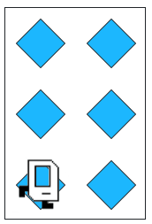

## Assignment
Your country is prototyping hospital-building robots. They have decided to enlist Karel robots. Your job is to program those robots.

Karel begins at the left end of a row that might look like this:


Each beeper in the figure represents a pile of supplies. Karel’s job is to walk along the row and build a new hospital in the places marked by each beeper. Each hospital should be two columns of three beepers, like this:



The new hospital should have their corner at the point at which the pile of supplies was left. At the end of the run, Karel should be at the end of the row having created a set of hospitals. For the initial conditions shown, the result would look like this:


Keep in mind the following information about the world:

* Karel starts facing east at (1, 1) with an infinite number of beepers in its beeper bag.

* The beepers indicating the positions at which hospitals should be built will be spaced so that there is room to build the hospitals without overlapping or hitting walls.

* There will be no supplies left on the last column.

* Karel should not run into a wall if it builds a hospital that extends into that final corner.

Write a program to implement the Hospital Building Karel project. Remember that your program should work for any world that meets the above conditions.

```python
from karel.stanfordkarel import *

# Here is a place to program your Section problem

def main():
    """
    You should write your code to make Karel do its task in
    this function. Make sure to delete the 'pass' line before
    starting to write your own code. You should also delete this
    comment and replace it with a better, more descriptive one.
    """
    pass

if __name__ == '__main__':
    main()
```

## Answer
```python
from karel.stanfordkarel import *

def turn_right():
    """Helper function to turn Karel 90 degrees right."""
    for i in range(3):
        turn_left()

def main():
    while front_is_clear():
        # Only build if there's a 'seed' beeper present
        if beepers_present():
            build_hospital()
        # Move to the next potential site
        if front_is_clear():
            move()

def build_hospital():
    """
    Builds a 3x2 hospital. 
    Assumes Karel starts on the first beeper.
    """
    turn_left()
    # First column: only add 2 more beepers to the existing 1
    move()
    put_beeper()
    move()
    put_beeper()
    
    # Move to the top of the second column
    turn_right()
    move()
    turn_right()
    
    # Second column: needs all 3 beepers
    put_beeper()
    move()
    put_beeper()
    move()
    put_beeper()
    
    # Return to the ground and face East
    turn_left()


if __name__ == '__main__':
    main()
```

## Key

```python
"""
Program: Hospital Karel
Karel traverses 1st Street from west to east, building hospitals
wherever it encounters a beeper.
"""
from karel.stanfordkarel import *

def main():
    while front_is_clear():
        if beepers_present():
            build_hospital()
        safe_move()


def build_hospital():
    """
    Karel picks up supplies and builds a hospital.
    Pre-condition: Karel is on a beeper, representing a
        pile of supplies. Karel is facing east.
    Post-condition: Karel is standing at the bottom
        of the last column of the hospital, facing east.
    """
    # pick up supplies
    pick_beeper()
    do_one_column()
    move()
    do_one_column()


def do_one_column():
    """
    Karel builds a single column of a hospital.
    Pre-condition: Karel is facing east at the bottom
        of where we want to build a column.
    Post-condition: Karel is facing east at the bottom
        of the column it just built.
    """
    turn_left()
    put_three_beepers()
    return_to_base()
    turn_left()


def put_three_beepers():
    """
    Karel places three beepers in a row.
    Pre-condition: Karel is on the corner where we want
        to place the first beeper.
    Post-condition: Karel is on the corner where it
        placed the third beeper in a row.
    """
    put_beeper()
    move()
    put_beeper()
    move()
    put_beeper()


def return_to_base():
    """
    Karel turns around and goes to the wall.
    Pre-condition: Karel is at the end of the column
        it just built, facing north.
    Post-condition: Karel has returned to 1st Street,
        below the column is just built, facing south.
    """
    turn_around()
    move_to_wall()


def move_to_wall():
    while front_is_clear():
        move()


def safe_move():
    if front_is_clear():
        move()


def turn_around():
    turn_left()
    turn_left()


# Note: turn_right() is not called above but added for reference.
def turn_right():
    for i in range(3):
        turn_left()

    

if __name__ == '__main__':
    main()
```