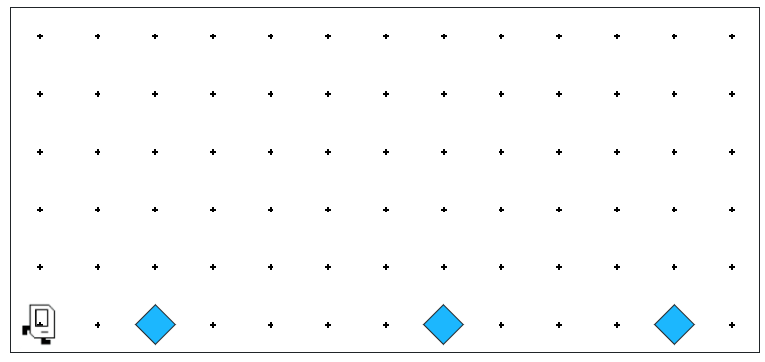
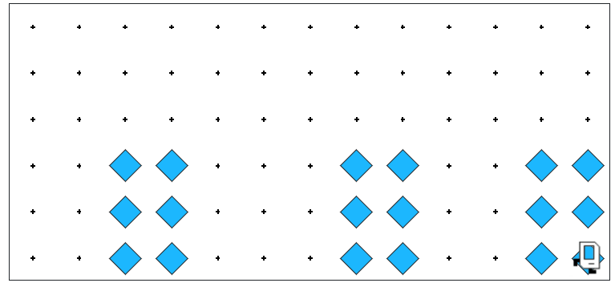

# Section 1: Karel the Robot

This week in section, your first priority is to meet your section leader and discover what sections in Code in Place are all about. Your section leader will therefore spend the first part of section on introductions and course logistics. Afterwards, you'll solve a Karel problem together using functions, loops and if-statements. 

Here's the [Link to the Section 1 Code](https://codeinplace.stanford.edu/cip6/ide/a/hospital)

## Hospital Karel

Countries around the world are dispatching hospital-building robots to make sure anyone who gets sick can be treated. They have decided to enlist Karel robots, and your job is to program those robots.

Karel begins at the left (west) end of a row that might look like this:

Each beeper represents a pile of supplies. Karel's job is to walk along the 1st row and build a new hospital in the places marked by each beeper. The new hospital should start at the point at which the beeper was left.

At the end of the run, Karel should be at the end of the 1st row having created a set of hospitals that look like this for the initial conditions shown above:

Keep in mind the following information about the world:

* Karel starts facing east at (1, 1) with an infinite number of beepers in its beeper bag.

* The world can be any size, but you can assume there will always be enough space to build each hospital without overlapping or hitting walls.

* Karel should not run into a wall when running your program.

Write the code to implement Hospital Karel. Use helper functions. Think, "what are the high-level steps Karel needs to take?" and make these steps into helper functions. Can you teach Karel how to build one hospital before you have Karel try to build many? Remember that your program should work for any world that meets the above conditions.

