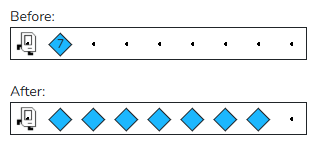

## Assignment

In this task Karel starts by standing in front of a pile of beepers that Karel needs to spread out along the row. Here is an example before and after.



You may assume that:

* There is only one row in the world
* Karel starts with infinite beepers in her bag
* The pile of beepers is on the second corner, directly in front of where Karel starts
* The world is wide enough for all the beepers, with at least one free space at the end

Write the code to implement Spread Beepers Karel. Come up with a strategy first. Think, "what are the high-level steps Karel needs to take?" and make these steps into helper functions. Remember that your program should work for a pile of any size. 

```python
from karel.stanfordkarel import *

"""
Each row starts with a stack of beepers. Karel should pick them
up, one at a time, and spread them down the row. 
Caution! Karel can't count, and starts with infinite beepers in
her bag. How can you solve this puzzle?
"""


def main():
    """
    You should write your code to make Karel do its task in
    this function. Make sure to delete the 'pass' line before
    starting to write your own code. You should also delete this
    comment and replace it with a better, more descriptive one.
    """
    pass


# There is no need to edit code beyond this point
if __name__ == '__main__':
    main()
```

## Answer

```python
from karel.stanfordkarel import *

# let it go to starting point at the end

## helper function

## 1 turn back 

def turn_back():
    turn_left()
    turn_left()

## 2 move to the start
def move_to_start():
    turn_back()
    while front_is_clear():
        move()
    turn_back()
    
## 3 move to next
def move_to_next():
    while beepers_present():
        move()

## 4 work function find and spread beeper
def spread():
    while beepers_present():
        pick_beeper() # karel can only pick 
        if beepers_present():
            move_to_next()
            put_beeper()
            move_to_start()
            move()
    put_beeper()

## Main 
def main():
    move()
    spread()
    move_to_start()

# There is no need to edit code beyond this point
if __name__ == '__main__':
    main()
```

## Key Answer

```python
from karel.stanfordkarel import *

"""
Each row starts in front of a stack of beepers. Karel should pick them
up, one at a time, and spread them down the row. 
Caution! Karel can't count, and starts with infinite beepers in
her bag. How can you solve this puzzle?
"""

def main():
    move()
    spread()
    step_back()
    
def spread():
    while beepers_present():
        pick_beeper()
        if beepers_present():
            move_to_end()
            put_beeper()
            reset()
    put_beeper()

def move_to_end():
    while beepers_present():
        move()

def reset():
    turn_around()
    move_to_wall()
    turn_around()
    move()

def move_to_wall():
    while front_is_clear():
        move()

def turn_around():
    turn_left()
    turn_left()
    
def step_back():
    turn_around()
    move()
    turn_around()


# There is no need to edit code beyond this point
if __name__ == '__main__':
    main()
```