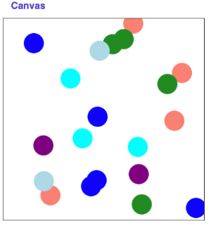

## Assignment
## Section 5: Graphics
In this section, our goal is to work on a graphics problem together.

## Problem: Random Circles

Write a program that draws a 20 circles at random positions with random colors on the canvas. You are provided with the constants N_CIRCLES (the number of circles to draw), CANVAS_WIDTH and CANVAS_HEIGHT (the width and height of the canvas, respectively) and CIRCLE_SIZE (the width and height of each circle respectively). Specifically, your job is to implement the following function:

```python
def draw_random_circle(canvas):
```

which takes as a parameter the canvas that will be used to draw all of the random circles. In order to choose a random color, we have a defined a function for you to use called random_color(). It will return a random color that you can use for a given circle. 

```python
def random_color():
    colors = ['blue', 'purple', 'salmon', 'lightblue', 'cyan', 'forestgreen']
    return random.choice(colors)
```

Making all the necessary calls to your `draw_random_circle(...)` function should produce something that looks like this (of course with randomness yours will have the circles in different locations:



## Possible Extensions:

If you find you have extra time you can try adding the following extensions on to this problem

1. Draw a random number of circles between 1 and 20
2. Draw circles of a random size 
3. Draw the circles such that all parts of the circle are within the canvas.

---

```python
from graphics import Canvas
import random

CANVAS_WIDTH = 300
CANVAS_HEIGHT = 300
CIRCLE_SIZE = 20
N_CIRCLES = 20

def main():
    print('Random Circles')
    canvas = Canvas(CANVAS_WIDTH, CANVAS_HEIGHT)
    
def random_color():
    """
    This is a function to use to get a random color for each circle. We have
    defined this for you and there is no need to edit code in this function,
    but feel free to read it over if you are interested. 
    """
    colors = ['blue', 'purple', 'salmon', 'lightblue', 'cyan', 'forestgreen']
    return random.choice(colors)

if __name__ == '__main__':
    main()
```

## Answer

```python
from graphics import Canvas
import random

# Step/ Intution
# - draw 20 circcles (random positions, random colors)
# - Given
    # -N_Circles => number of circles to draw
    # CANVAS WIDTH and CANVAS HEIGHT => the height and width of circle
    # CIRCLE SIZE => size of the circle to be drawn

# Implement a funtion
    #   - draw_random_circle(canvas)

CANVAS_WIDTH = 300
CANVAS_HEIGHT = 300
CIRCLE_SIZE = 20
N_CIRCLES = 20

def main():
    print('Random Circles')
    canvas = Canvas(CANVAS_WIDTH, CANVAS_HEIGHT)
    # Call your drawing function and pass the canvas to it
    draw_random_circle(canvas)
    
def draw_random_circle(canvas):
    """
    Draws N_CIRCLES at random positions with random colors on the canvas.
    """
    for i in range(N_CIRCLES):
        # 1. Choose a random color using the provided helper function
        color = random_color()
        
        # 2. Pick a random top-left coordinate, keeping the circle on the canvas
        max_x = CANVAS_WIDTH - CIRCLE_SIZE
        max_y = CANVAS_HEIGHT - CIRCLE_SIZE
        x1 = random.randint(0, max_x)
        y1 = random.randint(0, max_y)
        
        # 3. Calculate the bottom-right coordinates
        x2 = x1 + CIRCLE_SIZE
        y2 = y1 + CIRCLE_SIZE
        
        # 4. Draw the circle onto the canvas
        canvas.create_oval(x1, y1, x2, y2, color)

def random_color():
    """
    This is a function to use to get a random color for each circle. We have
    defined this for you and there is no need to edit code in this function,
    but feel free to read it over if you are interested. 
    """
    colors = ['blue', 'purple', 'salmon', 'lightblue', 'cyan', 'forestgreen']
    return random.choice(colors)

if __name__ == '__main__':
    main()
```

## Key 

```python
from graphics import Canvas
import random

CANVAS_WIDTH = 300
CANVAS_HEIGHT = 300
CIRCLE_SIZE = 20
N_CIRCLES = 20

def main():
    print('Random Circles')
    canvas = Canvas(CANVAS_WIDTH, CANVAS_HEIGHT)
    for i in range(N_CIRCLES):
        draw_random_circle(canvas)
        
def draw_random_circle(canvas):
    x = random.randint(0, CANVAS_WIDTH)
    y = random.randint(0, CANVAS_HEIGHT)
    color = random_color()
    canvas.create_oval(x, y, x + CIRCLE_SIZE, y + CIRCLE_SIZE, color)
    
def random_color():
    """
    This is a function to use to get a random color for each circle. We have
    defined this for you and there is no need to edit code in this function,
    but feel free to read it over if you are interested. 
    """
    colors = ['blue', 'purple', 'salmon', 'lightblue', 'cyan', 'forestgreen']
    return random.choice(colors)

if __name__ == '__main__':
    main()
```