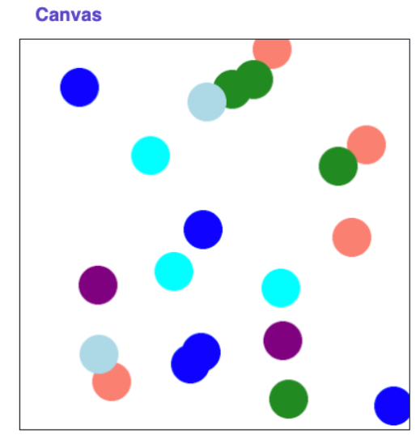

## Section 5: Random Circles
Link to the Section 5 Code: \
Random Circles 

In this section, our goal is to work on a graphics problem together.

Write a program that draws circles at random positions with random colors on the canvas. You are provided with the constants N_CIRCLES (the number of circles to draw), CANVAS_WIDTH and CANVAS_HEIGHT (the width and height of the canvas, respectively), and CIRCLE_SIZE (which is both the width and height of the circle). Specifically, your job is to complete the following function:

```python
def draw_random_circle(canvas):
    # TODO your code here
```

which takes as a parameter the canvas that will be used to draw all of the random circles. 

### Starter Code

```python
CANVAS_WIDTH = 300
CANVAS_HEIGHT = 300
CIRCLE_SIZE = 20
N_CIRCLES = 20

def main():
    canvas = Canvas(CANVAS_WIDTH, CANVAS_HEIGHT)
    # TODO your code here
```

This code already creates a canvas for you. You will need to use this canvas to draw your circles! Running your program should produce something that looks like this (of course with randomness yours will have the circles in different locations:



### Random Color:

In order to choose a random color, we have a defined a function for you to use called random_color. It will return a random color that you can use for a given circle. 

```python
def random_color():
    colors = ['blue', 'purple', 'salmon', 'lightblue', 'cyan', 'forestgreen']
    return random.choice(colors)
```

## Possible Extensions:

If you find you have extra time you can try adding the following extensions on to this problem

1. Draw a random number of circles between 1 and 20
2. Draw circles of a random size 
3. Draw the circles such that all parts of the circle are within the canvas.

