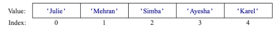

## Assignment

## Problem #1: Index Game
As a warmup, read this code and play the game a few times. Use this mental model of the list:



The goal is to get comfortable with how indices work with lists! How you should be playing this game is as follows:

1. The code we provide generates an index for you
2. A student is selected (or someone volunteers!)
3. The person predicts the name stored in the index
4. Repeat steps 1-3 until people are comfortable!


---

#### Given Code

```python
import random

def main():
    # 1. Understand how to create a list and add values
    # A list is an ordered collection of values
    names = ['Julie', 'Mehran', 'Simba', 'Ayesha']
    names.append('Karel')

    # 2. Understand how to loop over a list
    # this prints the list to the screen one value at a time
    for value in names:
        print(value)

    # 3. Understand how to look up the length of a list
    # use randint to select a valid "index" 
    max_index = len(names) - 1
    index = random.randint(0, max_index)

    # 4. Understand how to get a value by its index
    # get the item at the chosen index
    correct_answer = names[index]

    # This is just like in Khansole Academy...
    # prompt the user for an answer, check if it is correct
    prompt = 'Who is in index...' + str(index) + '? '
    answer = input(prompt)
    if answer == correct_answer:
        print('Good job')
    else:
        print('Correct answer was', correct_answer)

if __name__ == '__main__':
    main()
```


## Key

### Index Game Solution

```python
import random

def main():
    # 1. Understand how to create a list and add values
    # A list is an ordered collection of values
    names = ['Julie', 'Mehran', 'Simba', 'Ayesha']
    names.append('Karel')

    # 2. Understand how to loop over a list
    # this prints the list to the screen one value at a time
    for value in names:
        print(value)

    # 3. Understand how to look up the length of a list
    # use randint to select a valid "index" 
    max_index = len(names) - 1
    index = random.randint(0, max_index)

    # 4. Understand how to get a value by its index
    # get the item at the chosen index
    correct_answer = names[index]

    # This is just like in Khansole Academy...
    # prompt the user for an answer, check if it is correct
    prompt = 'Who is in index...' + str(index) + '? '
    answer = input(prompt)
    if answer == correct_answer:
        print('Good job')
    else:
        print('Correct answer was', correct_answer)

if __name__ == '__main__':
    main()
```