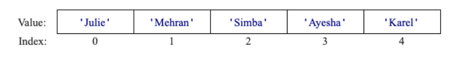

## Section 6: Lists and Dicts

Section 6 Code: \
Index Game, List Practice, Heads Up 

## Problem #1: Index Game
As a warmup, read this code and play the game a few times. Use this mental model of the list:



The goal is to get comfortable with how indices work with lists! How you should be playing this game is as follows:

1. The code we provide generates an index for you
2. A student is selected (or someone volunteers!)
3. The person predicts the name stored in the index
4. Repeat steps 1-3 until people are comfortable!

## Problem #2: List Practice
Now practice writing code with lists! Implement the functionality described in the comments below. 

```python
def main():
    # Create a list called `fruit_list` that contains the following fruits: 
    # 'apple', 'banana', 'orange', 'grape', 'pineapple'.
    
    
    # Print the length of the list.

    
    # Add 'mango' at the end of the list. 


    # Print the updated list.
```

## Problem #3: Heads Up

Our next goal is to learn how to read data from files. Loading data from a file can be useful for many final projects. Write a program that runs a console version of the phone game Heads Up!


### How the game is played remotely:
When it is your turn, close your eyes. \
A word will be displayed in the HeadsUp program.\
The rest of the section will try and describe it without saying the word.\
You have to guess the word as quickly as possible.

### Milestones
Milestone #1: Read the provided function that loads all of the words from the file cswords.txt into a list. \
Milestone #2: Then, show a randomly chosen word from the list \
Milestone #3: Repeat: wait for the user to hit enter, then show another word.