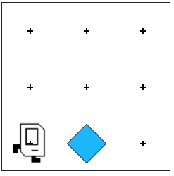
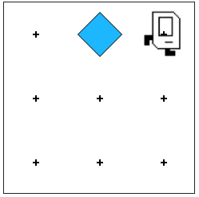

# Example 02 - Move Beeper

### Question
Karel will start out in a world with 3 rows and 3 columns, in front of a beeper, like so:



Your job is to make Karel pick up the beeper, move to the top of the world, put the beeper down at the top of column 2, and then end up in the top right corner, so that the end result looks like this:



```python
"""
This is a worked example. This code is starter code; you should edit and run it to
solve the problem. You can click the blue show solution button on the left to see
the answer if you get too stuck or want to check your work!
"""

from karel.stanfordkarel import *

def main():
    """
    Karel starts facing East in the bottom left corner of the world and ends facing East in the bottom right corner of the world.
    """
    pass  # Delete this line and write your code here! :)


# There is no need to edit code beyond this point

if __name__ == '__main__':
    main()
```

### Answer
```python
from karel.stanfordkarel import *

def main():
    """
    Moves beeper up 2 rows and ends Karel in the top right corner.
    """
    get_beeper() # Move to beeper and pick it up
    move_up() # Move up 2 rows
    put_beeper() # Put beeper down
    move() # End in top right corner

def get_beeper():
    """ Karel starts facing East in the bottom left of the world and ends having picked up the beeper, one spot forwards. """
    move()
    pick_beeper()

def move_up():
    """ Karel starts facing East in row 1 and ends facing East in row 3. """
    turn_left()  # Face North
    move()  # Move to row 2
    move()  # Move to row 3
    turn_right()  # Face East

def turn_right():
    turn_left()
    turn_left()
    turn_left()


# There is no need to edit code beyond this point

if __name__ == '__main__':
    main()
```