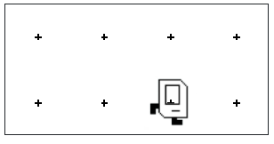

## Assignment:
Your task: Write a program in the editor, that makes Karel move, pick a beeper, then move.

If you are feeling stuck ask a question on the discussion forum:
https://codeinplace.stanford.edu/cip6/forum


The "editor" is the area to the right with the tab heading "main.py" where you can write text. You should write a solution as a Karel program.

Your program should have a main function with three commands:

1. move()
2. pick_beeper()
3. move()

When you hit the run button, your program will execute line-by-line. After it finishes, Karel's world should look like this:



```python
from karel.stanfordkarel import *

# File: warmup.py
# -----------------------------
# The warmup program defines a "main"
# function which currently just has one
# Command. Add two more commands to make karel: move(),
# pick_beeper(), move()
def main():
    move()
    # add your code here
   
   
   
# don't edit these next two lines
# they tell python to run your main function
if __name__ == '__main__':
    main()
```

## Answer:
```python
from karel.stanfordkarel import *

# File: warmup.py
# -----------------------------
# The warmup program defines a "main"
# function which currently just has one
# Command. Add two more commands to make karel: move(),
# pick_beeper(), move()
def main():
    move()
    pick_beeper()
    move()
   
if __name__ == '__main__':
    main()
```


