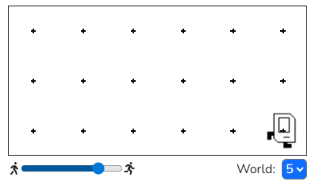

# Example - Move 5
Move forward 5 times.

```python
"""
This is a worked example. This code is starter code; you should edit and run it to 
solve the problem. You can click the blue show solution button on the left to see 
the answer if you get too stuck or want to check your work!
"""

from karel.stanfordkarel import *

def main():
    """
    Moves forward 5 times
    """
    pass # Delete this line and write your code here! :)


# There is no need to edit code beyond this point

if __name__ == '__main__':
    main()
```

## Answer
```python
from karel.stanfordkarel import *

def main():
    """ Moves forward 5 times """
    # Since we are moving forward a known number of times, we can use a for-loop to repeat move()
    for i in range(5):
        move()


# There is no need to edit code beyond this point

if __name__ == '__main__':
    main()
```

