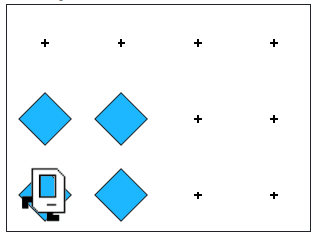

# Example - Square

Make Karel place beepers in a square (4 beepers total) and end in the same position Karel starts in. Make sure to try doing it using a for-loop!

After running your program, you should see the following:



```python
"""
This is a worked example. This code is starter code; you should edit and run it to 
solve the problem. You can click the blue show solution button on the left to see 
the answer if you get too stuck or want to check your work!
"""

from karel.stanfordkarel import *

def main():
    """
    Makes Karel place beepers in a square (4 beepers total) and end in the same position Karel starts in.
    """
    
    pass # Delete this line and write your code here! :)


# There is no need to edit code beyond this point

if __name__ == '__main__':
    main()
```

## Answer

```python
from karel.stanfordkarel import *

def main():
    """ Makes Karel place beepers in a square (4 beepers total) and end in the same position Karel starts in. """
    # If we consider the task carefully, we need to repeat several actions
    # Since we are repeating a these actions a known number of times, we use a for-loop
    for i in range(4):
        # Put beeper
        put_beeper()

        # Makes us move in a square motion when we do it four times
        move()
        turn_left()


# There is no need to edit code beyond this point

if __name__ == '__main__':
    main()
```