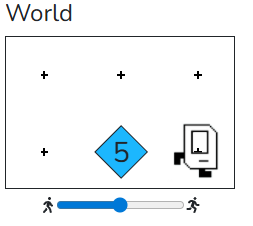
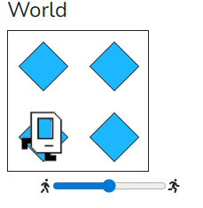

# Example 01

```python
"""
This is an example of a program that uses a for loop
It places 5 beepers. If you change the value from 5 
to something like 10, Karel will place a different
number of beepers
"""

# This tells python who Karel is!
from karel.stanfordkarel import *

# this program executes in a special function called main
def main():
    move()
    for i in range(5):
        put_beeper()
    move()

# This is "boilerplate" code which launches your code
# when you hit the run button
if __name__ == '__main__':
    main()
```



# Example 02

```python
"""
This is an example of a program that has Karel 
place a square of beepers. It uses a for loop
that has multiple lines in the loop.
"""

# This tells python who Karel is!
from karel.stanfordkarel import *

# this program executes in a special function called main
def main():
    for i in range(4):
        move()
        put_beeper()
        turn_left()

# This is "boilerplate" code which launches your code
# when you hit the run button
if __name__ == '__main__':
    main()
```

