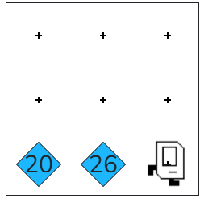

## Assignment

Congratulations on beginning your coding journey! Karel welcomes you to Code in Place 2026. Your next task is to help Karel celebrate the occasion by placing 20 beepers, moving Karel one step, placing 26 beepers, and moving Karel one more step. The world should ultimately look like this:



There are many ways to get this correct. In order to program this well, you should be using two for-loops. Recall that a for-loop looks like this:

```python
for i in range(100):
    # things to repeat
    move()
````

This for-loop repeats move() 100 times. What do you want to repeat, and how many times?

## Answer

```python
from karel.stanfordkarel import *

def main():
    # Place 20 beepers
    for i in range(20):
        put_beeper()
    
    move()
    
    # Place 26 beepers
    for i in range(26):
        put_beeper()
    
    move()


if __name__ == '__main__':
    main()
````