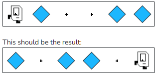

## Example - Invert

Karel will be in a single row world with beepers in some positions. Karel should "invert" the pattern of the row -- pick beepers from the spots with beepers and place beepers from the empty spots -- and end facing East in the rightmost position. There will be no more than 1 beeper in each spot. Be sure to invert the positions Karel starts and ends on!

For example, if this is the initial world:



```python
"""
This is a worked example. This code is starter code; you should edit and run it to 
solve the problem. You can click the blue show solution button on the left to see 
the answer if you get too stuck or want to check your work!
"""

from karel.stanfordkarel import *

def main():
    """
    Inverts the pattern of beepers in a single row world.
    """
    
    pass # Delete this line and write your code here! :)


# There is no need to edit code beyond this point

if __name__ == '__main__':
    main()
```

## Answer

```python
from karel.stanfordkarel import *

def main():
    """
    Inverts the pattern of beepers in a single row world.
    """
    invert_corner()  # Fencepost problem! This initial invert_corner() fixes it
    while front_is_clear():  # Since we don't know how many squares we need to invert, use a while-loop
        move()
        invert_corner()  # Invert each corner as we move


def invert_corner():
    if beepers_present():
        pick_beeper()
    else:
        put_beeper()


# There is no need to edit code beyond this point

if __name__ == '__main__':
    main()
```