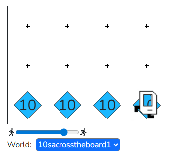

## Example - 10s across the board

Place 10 beepers in each position in the bottom row. Karel will begin in the bottom left corner of a world with no beepers; Karel should end in the bottom right corner of the world with 10 beepers across the bottom row (including the positions Karel starts and ends on!).

You could start by writing this assuming you know the number of columns (i.e. the length of each row) beforehand, and then tweak your code to make it work for any number of columns!

```python
"""
This is a worked example. This code is starter code; you should edit and run it to 
solve the problem. You can click the blue show solution button on the left to see 
the answer if you get too stuck or want to check your work!
"""

from karel.stanfordkarel import *

def main():
    """
    Put 10 beepers in every cell in the bottom row of the world.
    """
    
    pass # Delete this line and write your code here! :)


# There is no need to edit code beyond this point

if __name__ == '__main__':
    main()
```

## Answer

```python
from karel.stanfordkarel import *

def main():
    """
    Put 10 beepers in every cell in the bottom row of the world.
    """
    put_10_beepers()  # Fencepost bug! This initial put_10_beepers fixes it.
    while front_is_clear():  # Because we don't know when we will run into a wall, we use a while-loop to repeatedly move and put beepers
        move()
        put_10_beepers()

def put_10_beepers():
    """ Helper function to place 10 beepers in Karel's current position. """
    for i in range(10):  # Because we know we want to place exactly 10 beepers, use a for-loop to put_beeper 10 times
        put_beeper()


# There is no need to edit code beyond this point

if __name__ == '__main__':
    main()
```

