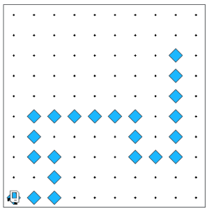

## Example - Follow trail



Karel starts off in a world where there is a mysterious trail of beepers. Karel starts off standing on a beeper. Help Karel follow the trail of beepers (picking up beepers as she goes) until the end! We guarantee that the trail will never lead Karel to a spot that is adjacent to a wall. In the world we've provided, we expect Karel to end up in the third cell down from the top right corner, facing East.

How might we approach this problem? Here's one outline (pseudocode) of how you could solve this:
* While Karel is standing on a beeper:
* Have her pick up beepers in the direction she is facing until there are no more, at which point she should stop.
* Have her take one step backwards and face the same way she was facing previously.
* Have her move one step to the left and check if there is a beeper.
* If there is, then the trail continues in that direction and she should keep going.
* If there isn't, then the trail either continues to the right of the direction she was initially facing, or the trail ends. In this case, she should turn around and move two steps forward so she is standing on the cell that is to the right of where she stopped.

You might find the following helper functions helpful:

* `follow_straight_trail()` should follow a straight trail of beepers in the direction Karel is facing, picking up beepers as she goes, until she is standing on a spot with no beepers.

* `turn_around()` turns Karel by 180 degrees.

* `step_backwards()` turns Karel around, moves, and turns her around again so she is facing the same direction as she started.

```python
"""
This is a worked example. This code is starter code; you should edit and run it to 
solve the problem. You can click the blue show solution button on the left to see 
the answer if you get too stuck or want to check your work!
"""

from karel.stanfordkarel import *

def main():
    """
    You should write your code to make Karel do its task in
    this function. Make sure to delete the 'pass' line before
    starting to write your own code. You should also delete this
    comment and replace it with a better, more descriptive one.
    """
    
    pass  # Delete this line and write your code here! :)


# There is no need to edit code beyond this point

if __name__ == '__main__':
    main()
```

## Answer

```python
from karel.stanfordkarel import *

def main():
    while beepers_present():
        follow_straight_trail()
        step_backwards()
        # Check left
        turn_left()
        move()
        if no_beepers_present():
            # Trail doesn't continue to the left;
            # Go right
            step_backwards()
            turn_around()
            move()
            # Here the next iteration of the loop will check if there is a beeper; if there is we will keep going and if not we will stop!
    
def follow_straight_trail():
    while beepers_present():
        pick_beeper()
        move()

def step_backwards():
    """
    Turn around and go back one step, 
    then face the same way you were when you started
    """
    turn_around()
    move()
    turn_around()

def turn_around():
    turn_left()
    turn_left()


# There is no need to edit code beyond this point

if __name__ == '__main__':
    main()
```