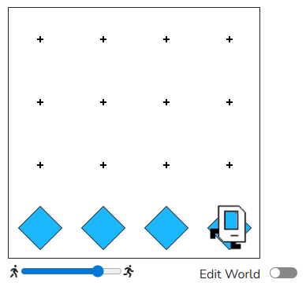

## The "Safety Rail" (Beginner)

**The Mission:** \
Karel is walking along a cliff (the bottom of the world). Every time there is a "gap" (no wall above Karel), Karel must place a beeper to act as a safety rail.

**Goal:** \
Traverse the entire bottom row and put_beeper() only if left_is_clear().

```python
from karel.stanfordkarel import *

def main():
    while front_is_clear():
        if left_is_clear():
            put_beeper()
        move()
    # Check the very last corner
    if left_is_clear():
        put_beeper()

if __name__ == "__main__":
    main()
```

