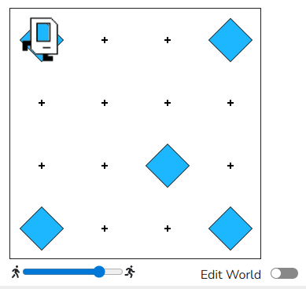

## Title: Karel’s Pentagon Pattern

Karel starts in the bottom-left corner of a blank 4x4 world, facing East. Your task is to write a program that makes Karel:
* Place a beeper in each of the four corners of the world.
* Place one beeper in the center of the grid (square (2,2)).
* End back at the starting position, facing East.
* Karel starts at (1,1) facing East

```python
from karel.stanfordkarel import *

# Karel Program: Pentagon Pattern
# World: 4x4 blank grid
# Karel starts at (1,1) facing East

def main():
    # Place beeper at bottom-left corner
    put_beeper()
    
    # Bottom-right corner
    move_three()
    put_beeper()
    
    # Top-right corner
    turn_left()
    move_three()
    put_beeper()
    
    # Top-left corner
    turn_left()
    move_three()
    put_beeper()
    
    # Move to center (2,2)
    turn_left()
    move_two()
    turn_left()
    move_two()
    put_beeper()
    
    # Return home (bottom-left corner)
    turn_left()
    turn_left()
    move_two()
    turn_right()
    move_two()
    turn_right()

def move_three():
    for i in range(3):
        move()

def move_two():
    for i in range(2):
        move()

def turn_right():
    turn_left()
    turn_left()
    turn_left()

if __name__ == "__main__":
    main()

```

