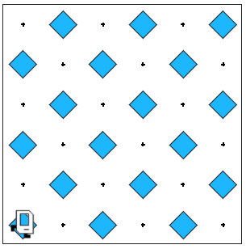
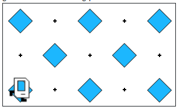

## Assignment
Get Karel to create a checkerboard pattern of beepers inside an empty rectangular world, as illustrated below:



Note: Karel should end up where she starts

As you think about how you will solve the problem, you should make sure that your solution works with checkerboards that are different in size from the standard 6x6 checkerboard shown in the example above. Some examples of such cases are discussed below. Odd-sized checkerboards are tricky, and you should make sure that your program generates the following pattern in a 5x3 world:



This problem is hard: Try simplifying your solution with decomposition. Can you checker a single row/column? Make the row/column work for different widths/heights? Once you've finished a single row/column, can you make Karel fill two? Three? All of them? Incrementally developing your program in stages helps break it down into simpler parts and is a wise strategy for attacking hard programming problems.

```python
from karel.stanfordkarel import *

"""
Karel builds a checkerboard pattern and returns to start.
"""

def main():
    run()
    return_back()

def run():
    put_beeper()
    complete_east_line()

def complete_east_line():
    alternate_to_wall()
    turn_left()
    if front_is_clear():
        start_next_line()
        turn_left()
        complete_west_line()

def complete_west_line():
    alternate_to_wall()
    turn_right()
    if front_is_clear():
        start_next_line()
        turn_right()
        complete_east_line()

def start_next_line():
    if beepers_present():
        move()
    else:
        move()
        put_beeper()

def alternate_to_wall():
    while front_is_clear():
        if beepers_present():
            move()
        else:
            move()
            put_beeper()

def return_back():
    # Turn around
    turn_left()
    turn_left()
    
    # Go to bottom
    while front_is_clear():
        move()
    
    # Face west
    turn_right()
    
    # Go to left wall
    while front_is_clear():
        move()
    
    # Face original direction (east)
    turn_right()
    turn_right()

def turn_right():
    turn_left()
    turn_left()
    turn_left()


# There is no need to edit code beyond this point
if __name__ == '__main__':
    main()
```