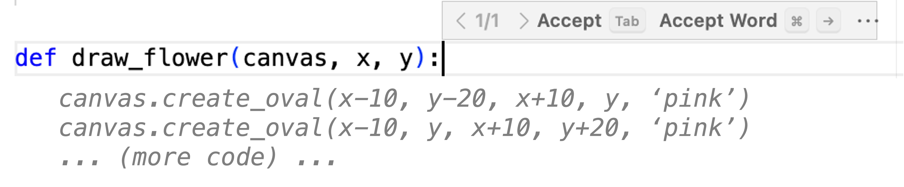
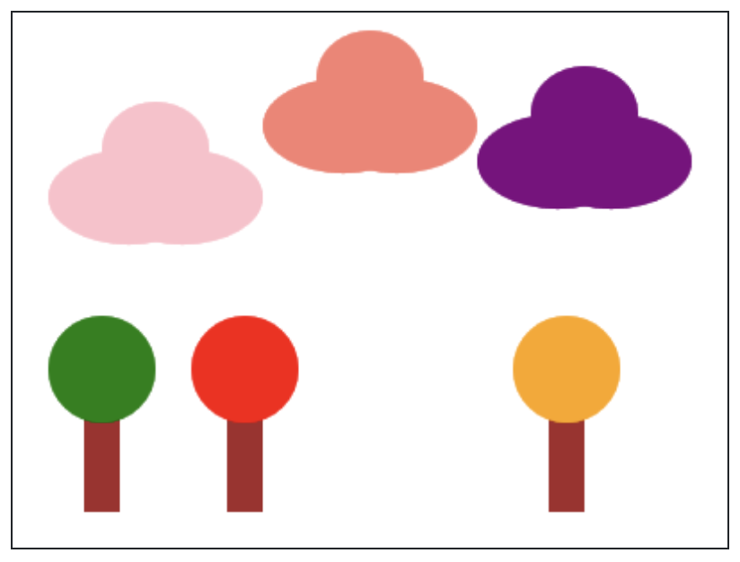

## Assignment

## Scene with Functions

In this assignment, you will draw a natural scene while practicing how to break a program into functions with parameters. You are also being given an AI code-completion tool for this assignment. The tool can suggest code, but you are responsible for reading the generated code carefully and deciding whether it is correct.

This assignment is self-graded. When you have visited the page, read this disclosure, and tried the assignment, use the normal mark-complete action to acknowledge participation and complete it.

## How the AI autocomplete works

Sometimes the editor will show suggested code in light gray text. This is called ghost text. If you like the suggestion, press Tab to accept it. If you do not want it, keep typing or ignore it.



For this assignment, the AI only tries to help after you write an empty Python function header. A function header starts with def, includes a function name and parameters, and ends with :

```python
def draw_cloud(canvas, x, y, color):
```

After you finish the final colon, the AI may suggest a function body. The suggestion might be useful, but it can also make mistakes. Check the coordinates, colors, parameters, and indentation before you accept or keep any suggested code.

## Your goal

Use Stanford graphics to draw a scene from nature. You can start by copying the provided examples, then make the scene your own by changing colors, positions, sizes, and adding at least one new object.



* Write functions that draw reusable scene parts, such as clouds, trees, mountains, flowers, the sun, or the ground.
* Use parameters so the same function can draw similar objects in different places, sizes, or colors.
* Call your functions several times from main() to compose the full scene.
* Read any AI-generated code before accepting it. You can edit, delete, or ignore suggestions.

```python
from graphics import Canvas
import math
    
CANVAS_WIDTH = 400
CANVAS_HEIGHT = 300

CLOUD_WIDTH = 120
CLOUD_HEIGHT = 80

TRUNK_HEIGHT = 80
TRUNK_WIDTH = 20
LEAVES_SIZE = 60

TREE_BOTTOM_Y = CANVAS_HEIGHT - 20 

def main():
    canvas = Canvas(CANVAS_WIDTH, CANVAS_HEIGHT)
    draw_cloud(canvas, 140, 10, 'salmon')
    # TODO: draw two more clouds, and three trees

def draw_cloud(canvas, x, y, color):
    """
    This function draws one cloud. You can call it and pass in 
    different values of x and y (the location of the cloud) and
    color (the color of the cloud). 
    """
    cloud_bottom_start_y = y + (1/3) * CLOUD_HEIGHT
    cloud_bottom_end_y = y + CLOUD_HEIGHT
    cloud_top_start_x = x + (1/4) * CLOUD_WIDTH
    cloud_top_end_x = x + (3/4) * CLOUD_WIDTH
    # Bottom two puffs
    canvas.create_oval(
        x, 
        cloud_bottom_start_y,
        x + (3/4) * CLOUD_WIDTH,
        cloud_bottom_end_y,
        color
    )
    canvas.create_oval(
        x + (1/4) * CLOUD_WIDTH, 
        cloud_bottom_start_y,
        x + CLOUD_WIDTH,
        cloud_bottom_end_y,
        color
    )

    # Top puff
    canvas.create_oval(
        cloud_top_start_x,
        y,
        cloud_top_end_x,
        y + (2/3) * CLOUD_HEIGHT,
        color
    )

# TODO: You should define a function like draw_cloud
# for trees, as well as for any extra elements in the scene.


if __name__ == '__main__':
    main()
```


## Answer

```python
from graphics import Canvas
import math
    
CANVAS_WIDTH = 400
CANVAS_HEIGHT = 300

CLOUD_WIDTH = 120
CLOUD_HEIGHT = 80

TRUNK_HEIGHT = 80
TRUNK_WIDTH = 20
LEAVES_SIZE = 60

TREE_BOTTOM_Y = CANVAS_HEIGHT - 20 

def main():
    canvas = Canvas(CANVAS_WIDTH, CANVAS_HEIGHT)
    
    # Draw three clouds with the correct layout and colors
    draw_cloud(canvas, 20, 45, 'pink')
    draw_cloud(canvas, 140, 10, 'salmon')
    draw_cloud(canvas, 260, 45, 'purple')
    
    # Draw three trees with matching canopy colors and positions
    draw_tree(canvas, 50, TREE_BOTTOM_Y, 'brown', 'green')
    draw_tree(canvas, 125, TREE_BOTTOM_Y, 'brown', 'red')
    draw_tree(canvas, 290, TREE_BOTTOM_Y, 'brown', 'orange')

def draw_cloud(canvas, x, y, color):
    """
    This function draws one cloud. You can call it and pass in 
    different values of x and y (the location of the cloud) and
    color (the color of the cloud). 
    """
    cloud_bottom_start_y = y + (1/3) * CLOUD_HEIGHT
    cloud_bottom_end_y = y + CLOUD_HEIGHT
    cloud_top_start_x = x + (1/4) * CLOUD_WIDTH
    cloud_top_end_x = x + (3/4) * CLOUD_WIDTH
    
    # Bottom two puffs
    canvas.create_oval(
        x, 
        cloud_bottom_start_y,
        x + (3/4) * CLOUD_WIDTH,
        cloud_bottom_end_y,
        color
    )
    canvas.create_oval(
        x + (1/4) * CLOUD_WIDTH, 
        cloud_bottom_start_y,
        x + CLOUD_WIDTH,
        cloud_bottom_end_y,
        color
    )

    # Top puff
    canvas.create_oval(
        cloud_top_start_x,
        y,
        cloud_top_end_x,
        y + (2/3) * CLOUD_HEIGHT,
        color
    )

def draw_tree(canvas, x, bottom_y, trunk_color, leaves_color):
    """
    Draws a tree with a rectangular trunk and a circular canopy.
    The tree is centered horizontally around 'x' and sits on 'bottom_y'.
    """
    # Calculate trunk boundary coordinates
    trunk_left = x - (TRUNK_WIDTH / 2)
    trunk_right = x + (TRUNK_WIDTH / 2)
    trunk_top = bottom_y - TRUNK_HEIGHT
    
    # Render the trunk
    canvas.create_rectangle(
        trunk_left, 
        trunk_top, 
        trunk_right, 
        bottom_y, 
        trunk_color
    )
    
    # Calculate circular canopy bounding box coordinates
    leaves_left = x - (LEAVES_SIZE / 2)
    leaves_right = x + (LEAVES_SIZE / 2)
    leaves_top = trunk_top - (LEAVES_SIZE / 2)
    leaves_bottom = trunk_top + (LEAVES_SIZE / 2)
    
    # Render the leaves
    canvas.create_oval(
        leaves_left, 
        leaves_top, 
        leaves_right, 
        leaves_bottom, 
        leaves_color
    )

if __name__ == '__main__':
    main()
```