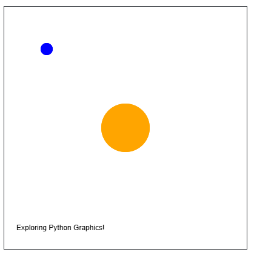

## Create your own graphics

```python
from graphics import Canvas
    
CANVAS_WIDTH = 400
CANVAS_HEIGHT = 400

def main():
    canvas = Canvas(CANVAS_WIDTH, CANVAS_HEIGHT)
    # TODO: your code here!

if __name__ == '__main__':
    main()
```

## Answer

```python
from graphics import Canvas

CANVAS_WIDTH = 400
CANVAS_HEIGHT = 400

def main():
    canvas = Canvas(CANVAS_WIDTH, CANVAS_HEIGHT)

    # 1. Draw the Sun in the exact center
    sun_size = 80
    sun_x = (CANVAS_WIDTH / 2) - (sun_size / 2)
    sun_y = (CANVAS_HEIGHT / 2) - (sun_size / 2)
    canvas.create_oval(sun_x, sun_y, sun_x + sun_size, sun_y + sun_size, "orange")

    # 2. Draw a small blue planet
    planet_size = 20
    planet_x = 60
    planet_y = 60
    canvas.create_oval(planet_x, planet_y, planet_x + planet_size, planet_y + planet_size, "blue")

    # 3. Add text at the bottom
    canvas.create_text(20, 360, "Exploring Python Graphics!")

if __name__ == '__main__':
    main()
```

