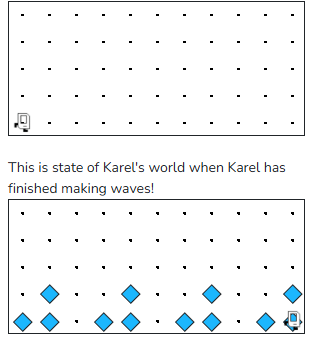

## Assignment
(Suggested 10 minutes)

Write a program that has Karel draw four small "waves". Each wave is a triangle made up of three beepers. There is a gap between each wave.

Karel starts in the bottom-left corner of the world, facing East. When the program ends, Karel should be in the bottom-right corner of the world. It does not matter which direction Karel is facing.

This is the state of Karel's world when Karel starts:



## A few notes

* Karel always begins at the bottom left corner of the world, facing East
* Karel's bag has infinite beepers.
* It does not matter which direction Karel ends up facing.
* You may assume that the world is always **exactly** 11 columns wide and 5 columns tall. Your program only needs to work for this sized world.
* You **must not** use any non-Karel features like variables, `return` or `break`. You may use any Karel features described in the course reader.

## Concepts

This problem mixes decomposition with loops. You need to recognize that each wave is the same pattern repeated several times, and then write a helper function that makes one wave. Once you can make one wave, the main challenge is moving Karel into position for the next wave without disturbing the pattern.

If this problem was challenging, we recommend reviewing decomposition and for loops. In particular, look back at examples where Karel repeats the same action several times and uses helper functions to make the program easier to understand.

---

**Given Code**

```python
from karel.stanfordkarel import *

def main():
    move()
    # TODO: your code here
   

# don't edit these next two lines
# they tell python to run your main function
if __name__ == '__main__':
    main()
```


## Answer

```python
from karel.stanfordkarel import *

def turn_right():
    turn_left()
    turn_left()
    turn_left()

def turn_around():
    turn_left()
    turn_left()

def build_wave():
    # assume Karel is at bottom-left of wave, facing East

    put_beeper()        # bottom-left of triangle
    move()
    put_beeper()        # bottom-right of triangle

    turn_left()
    move()
    put_beeper()        # top of triangle

    # go back down to bottom-right
    turn_around()
    move()
    turn_left()

def move_to_next_wave():
    move()  # 1 gap column
    move()  # skip 1 column (total shift = 3 columns per wave start)

def main():
    # Wave 1
    build_wave()
    move_to_next_wave()

    # Wave 2
    build_wave()
    move_to_next_wave()

    # Wave 3
    build_wave()
    move_to_next_wave()

    # Wave 4
    build_wave()

if __name__ == "__main__":
    main()
```
