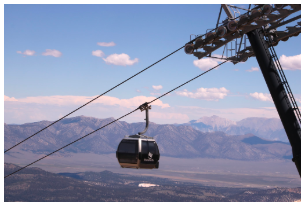
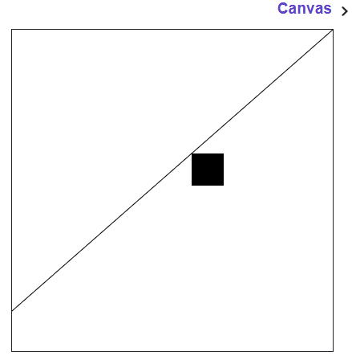

## Gondola lift

In this problem, we'll animate a simple gondola lift. Here's a real-life gondola lift -- you enter the little capsule at the bottom and it slowly draws you up the mountain to the top.



Run the starter code and note the diagonal line and the square (our "gondola") at the bottom left. Your job is to animate the square so its top left corner follows the line up and to the right in `NUM_STEPS` steps. You should use `NUM_STEPS` along with `lift_width` and `lift_height` to calculate how much you want to move the square **up** and to the **right** in each iteration.


```python
"""
This is a worked example. This code is starter code; you should edit and run it to 
solve the problem. You can click the blue show solution button on the left to see 
the answer if you get too stuck or want to check your work!
"""

from graphics import Canvas
import time

CANVAS_WIDTH = 400
CANVAS_HEIGHT = 400
SQUARE_SIZE = 40
DELAY = 0.01
NUM_STEPS = 500

def main():
    canvas = Canvas(CANVAS_WIDTH, CANVAS_HEIGHT)
    lift_left_x = 0
    lift_bottom_y = CANVAS_HEIGHT - 50
    
    # note these helpful variables!
    lift_width = CANVAS_WIDTH
    lift_height = lift_bottom_y
    
    canvas.create_line(
        lift_left_x, lift_bottom_y,
        lift_left_x + lift_width, lift_bottom_y - lift_height)

    gondola = canvas.create_rectangle(
        0, lift_bottom_y, 
        SQUARE_SIZE, lift_bottom_y + SQUARE_SIZE)

    for step_num in range(NUM_STEPS):
	    # write your code here!
	    
        time.sleep(DELAY)


# There is no need to edit code beyond this point

if __name__ == '__main__':
    main()
```

## Answer

```python
from graphics import Canvas
import time

CANVAS_WIDTH = 400
CANVAS_HEIGHT = 400
SQUARE_SIZE = 40
DELAY = 0.01
NUM_STEPS = 500

def main():
    canvas = Canvas(CANVAS_WIDTH, CANVAS_HEIGHT)
    lift_left_x = 0
    lift_bottom_y = CANVAS_HEIGHT - 50
    
    # note these helpful variables!
    lift_width = CANVAS_WIDTH
    lift_height = lift_bottom_y
    
    canvas.create_line(
        lift_left_x, lift_bottom_y,
        lift_left_x + lift_width, lift_bottom_y - lift_height)

    gondola = canvas.create_rectangle(
        0, lift_bottom_y, 
        SQUARE_SIZE, lift_bottom_y + SQUARE_SIZE)

    for step_num in range(NUM_STEPS):
        canvas.moveto(
            gondola, 
            lift_left_x + step_num * (lift_width / NUM_STEPS), 
            lift_bottom_y - step_num * (lift_height / NUM_STEPS))
        time.sleep(DELAY)


# There is no need to edit code beyond this point

if __name__ == '__main__':
    main()
```

### Output



