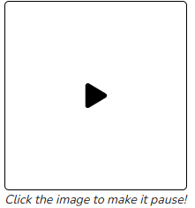

## Assignment
We've initialized a blue ball for you, and started you off with the mouse tracking code from lecture. Make the blue ball follow the mouse position so that **the mouse is at the center of the blue ball** as it moves!

A blue ball following a mouse, as it moves around the canvas. The ball is always centered on the mouse.



Recall that the graphics library has a moveto function

```python
canvas.moveto(object, new_x, new_y)
```

---

```python

from graphics import Canvas
import time

CANVAS_SIZE = 400
BALL_DIAMETER = 50
PAUSE_TIME = 1/50

def main():
    canvas = Canvas(CANVAS_SIZE, CANVAS_SIZE)
    ball = canvas.create_oval(
        0, 0,
        BALL_DIAMETER, 
        BALL_DIAMETER,
        'blue'
    )
    
    while True:
        mouse_x = canvas.get_mouse_x()
        mouse_y = canvas.get_mouse_y()
        
        # TODO: Write your code here!! :)
        
        time.sleep(PAUSE_TIME)
        print("Mouse location: (" + str(mouse_x) + ", " + str(mouse_y) + ")")


# There is no need to edit code beyond this point
if __name__ == '__main__':
    main()
```

## Answer

```python
from graphics import Canvas
import time

CANVAS_SIZE = 400
BALL_DIAMETER = 50
PAUSE_TIME = 1/50

def main():
    canvas = Canvas(CANVAS_SIZE, CANVAS_SIZE)
    ball = canvas.create_oval(
        0, 0,
        BALL_DIAMETER, 
        BALL_DIAMETER,
        'blue'
    )
    
    while True:
        mouse_x = canvas.get_mouse_x()
        mouse_y = canvas.get_mouse_y()
        
        # Make ball follow mouse (centered)
        new_x = mouse_x - BALL_DIAMETER / 2
        new_y = mouse_y - BALL_DIAMETER / 2
        canvas.moveto(ball, new_x, new_y)
        
        time.sleep(PAUSE_TIME)
        print("Mouse location: (" + str(mouse_x) + ", " + str(mouse_y) + ")")

if __name__ == '__main__':
    main()
```