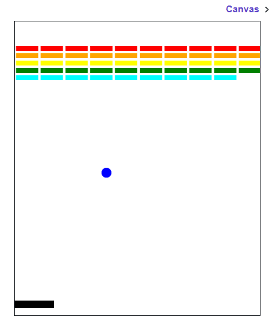

## Answer

```python
from graphics import Canvas
import time
import random

CANVAS_WIDTH = 500
CANVAS_HEIGHT = 600

PADDLE_Y = CANVAS_HEIGHT - 30
PADDLE_WIDTH = 80
PADDLE_HEIGHT = 15

BALL_RADIUS = 10
BALL_SIZE = BALL_RADIUS * 2

BRICK_GAP = 5
BRICK_WIDTH = (CANVAS_WIDTH - BRICK_GAP * 9) / 10
BRICK_HEIGHT = 10

ROWS = 5
COLS = 10


def main():
    canvas = Canvas(CANVAS_WIDTH, CANVAS_HEIGHT)

    # -------------------------
    # Create bricks
    # -------------------------
    colors = ["red", "orange", "yellow", "green", "cyan"]
    bricks = []
    brick_count = ROWS * COLS

    y_start = 50

    for row in range(ROWS):
        for col in range(COLS):

            x = col * (BRICK_WIDTH + BRICK_GAP) + BRICK_GAP / 2
            y = y_start + row * (BRICK_HEIGHT + BRICK_GAP)

            brick = canvas.create_rectangle(
                x, y,
                x + BRICK_WIDTH,
                y + BRICK_HEIGHT,
                colors[row]
            )

            bricks.append(brick)

    # -------------------------
    # Create paddle
    # -------------------------
    paddle = canvas.create_rectangle(
        CANVAS_WIDTH / 2 - PADDLE_WIDTH / 2,
        PADDLE_Y,
        CANVAS_WIDTH / 2 + PADDLE_WIDTH / 2,
        PADDLE_Y + PADDLE_HEIGHT,
        "black"
    )

    # -------------------------
    # Create ball
    # -------------------------
    ball = canvas.create_oval(
        CANVAS_WIDTH / 2 - BALL_RADIUS,
        CANVAS_HEIGHT / 2 - BALL_RADIUS,
        CANVAS_WIDTH / 2 + BALL_RADIUS,
        CANVAS_HEIGHT / 2 + BALL_RADIUS,
        "blue"
    )

    change_x = random.choice([-3, 3])
    change_y = 3

    turns = 3

    # -------------------------
    # GAME LOOP (3 turns)
    # -------------------------
    while turns > 0 and brick_count > 0:

        # reset ball each turn
        canvas.moveto(
            ball,
            CANVAS_WIDTH / 2 - BALL_RADIUS,
            CANVAS_HEIGHT / 2 - BALL_RADIUS
        )

        change_x = random.choice([-3, 3])
        change_y = 3

        while True:

            # -------------------------
            # Paddle follows mouse
            # -------------------------
            mouse_x = canvas.get_mouse_x()
            paddle_x = mouse_x - PADDLE_WIDTH / 2

            # keep paddle in bounds
            paddle_x = max(0, min(CANVAS_WIDTH - PADDLE_WIDTH, paddle_x))
            canvas.moveto(paddle, paddle_x, PADDLE_Y)

            # -------------------------
            # Move ball
            # -------------------------
            canvas.move(ball, change_x, change_y)

            ball_x = canvas.get_left_x(ball)
            ball_y = canvas.get_top_y(ball)

            # -------------------------
            # Wall collisions
            # -------------------------
            if ball_x <= 0 or ball_x + BALL_SIZE >= CANVAS_WIDTH:
                change_x = -change_x

            if ball_y <= 0:
                change_y = -change_y

            # bottom wall = lose turn
            if ball_y + BALL_SIZE >= CANVAS_HEIGHT:
                break

            # -------------------------
            # Paddle + brick collisions
            # -------------------------
            colliders = canvas.find_overlapping(
                ball_x,
                ball_y,
                ball_x + BALL_SIZE,
                ball_y + BALL_SIZE
            )

            for obj in colliders:
                if obj == ball:
                    continue

                # paddle hit
                if obj == paddle:
                    change_y = -abs(change_y)
                    break

                # brick hit
                if obj in bricks:
                    canvas.delete(obj)
                    bricks.remove(obj)
                    brick_count -= 1
                    change_y = -change_y
                    break

            time.sleep(0.01)

        turns -= 1

    # -------------------------
    # END GAME MESSAGE
    # -------------------------
    canvas.create_text(
        CANVAS_WIDTH / 2 - 50,
        CANVAS_HEIGHT / 2,
        "GAME OVER"
    )

    if brick_count == 0:
        canvas.create_text(
            CANVAS_WIDTH / 2 - 30,
            CANVAS_HEIGHT / 2 + 20,
            "YOU WIN!"
        )
    else:
        canvas.create_text(
            CANVAS_WIDTH / 2 - 30,
            CANVAS_HEIGHT / 2 + 20,
            "YOU LOSE!"
        )


if __name__ == '__main__':
    main()
```

### Output

