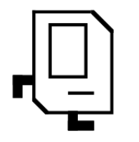
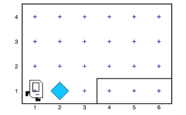
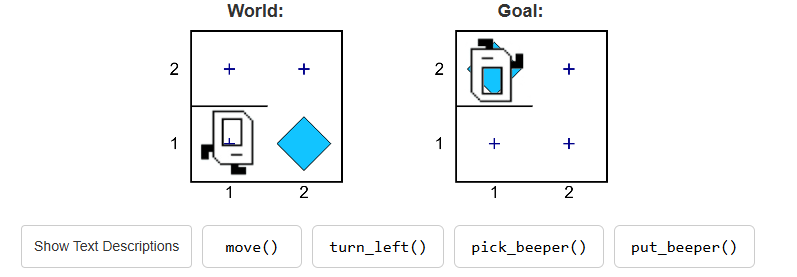

# Chapter 1: Introducing Karel the Robot

In the 1970s, a Stanford graduate student named Rich Pattis decided that it would be easier to teach the fundamentals of programming if students could somehow learn the basic ideas in a simple environment free from the complexities that characterize most programming languages. Rich designed an introductory programming environment in which students teach a robot to solve simple problems. That robot was named Karel, after the Czech playwright Karel Čapek, whose 1923 play R.U.R. (Rossum’s Universal Robots) gave the word robot to the English language.

  

Karel, a friendly rectangular white robot with two black feet.

Karel the Robot was quite a success. Karel has been used in introductory computer science courses all across the world and has been taught to millions of students. Many generations of Stanford students learned how programming works with Karel, and it is still the gentle introduction to coding used at Stanford.

## What is Karel?
Karel is a very simple robot living in a very simple world. By giving Karel a set of commands, you can direct it to perform certain tasks within its world. The process of specifying those commands is called programming. Initially, Karel understands only a very small number of predefined commands, but an important part of the programming process is teaching Karel new commands that extend its capabilities.

## Karel’s world
Karel’s world is defined by rows running horizontally (east-west) and columns running vertically (north-south). The intersection of a row and a column is called a corner. Karel can only be positioned on corners and must be facing one of the four standard compass directions (north, south, east, west). A sample Karel world is shown below. Here Karel is located at the corner of 1st row and 1st column, facing east.

## Karel's commands

| Command         | Description                                                                                                                                      |
|----------------|--------------------------------------------------------------------------------------------------------------------------------------------------|
| `move()`        | Asks Karel to move forward one block. Karel cannot respond to a `move()` command if there is a wall blocking its way.                          |
| `turn_left()`   | Asks Karel to rotate 90 degrees to the left (counterclockwise).                                                                                 |
| `pick_beeper()` | Asks Karel to pick up one beeper from a corner and stores the beeper in its beeper bag, which can hold an infinite number of beepers. Karel cannot respond to a `pick_beeper()` command unless there is a beeper on the current corner. |
| `put_beeper()`  | Asks Karel to take a beeper from its beeper bag and put it down on the current corner. Karel cannot respond to a `put_beeper()` command unless there are beepers in its beeper bag. |
