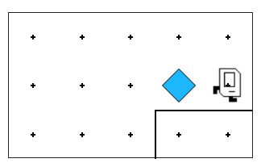

## Question # 01 - Step Up
Follow along the example from class. Have karel pick up the beeper and put it on the ledge, like so:



```python
"""
This is a worked example. This code is starter code; you should edit and run it to
solve the problem. You can click the blue show solution button on the left to see
the answer if you get too stuck or want to check your work!
"""

# This tells PyCharm who Karel is
# Every Karel file has a line just like it
from karel.stanfordkarel import *

# this program executes in a special function called main
def main():
    move()


# This is "boilerplate" code which launches your code
# when you hit the run button
if __name__ == '__main__':
    main()
```

## Answer
```python
from karel.stanfordkarel import *

def main():
    move()
    pick_beeper()      # Pick up the beeper
    turn_left()        # Move to the ledge
    move()
    turn_right()
    move()
    move()
    put_beeper()       # Put the beeper on the ledge
    move()

def turn_right():
    for _ in range(3):
        turn_left()

if __name__ == '__main__':
    main()
```