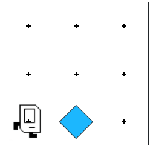
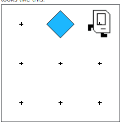

## Question # 2 - Move Beeper
Karel will start out in a world with 3 rows and 3 columns, in front of a beeper, like so:



Your job is to make Karel pick up the beeper, move to the top of the world, put the beeper down at the top of column 2, and then end up in the top right corner, so that the end result looks like this:



```python
"""
This is a worked example. This code is starter code; you should edit and run it to
solve the problem. You can click the blue show solution button on the left to see
the answer if you get too stuck or want to check your work!
"""

from karel.stanfordkarel import *

def main():
    """
    Karel starts facing East in the bottom left corner of the world and ends facing East in the bottom right corner of the world.
    """
    pass  # Delete this line and write your code here! :)


# There is no need to edit code beyond this point

if __name__ == '__main__':
    main()
```

## Answer

```python
from karel.stanfordkarel import *

def main():
    # Step 1: Pick up the beeper
    move()
    pick_beeper()
    
    # Step 2: Move to the top center (column 2, row 1)
    move()
    turn_left()
    move()
    move()

    turn_left()
    move()
    
    # Step 3: Put down the beeper
    put_beeper()
    
    # Step 4: Move to the top right corner
    turn_left()
    turn_left()
    move()
    
# Helper function to turn right
def turn_right():
    for i in range(3):
        turn_left()

if __name__ == '__main__':
    main()
```