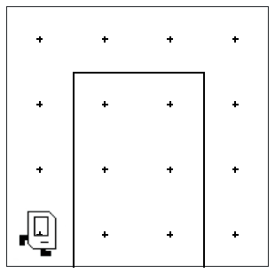
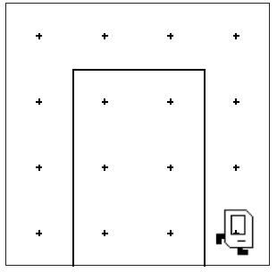

## Question # 4 - Archway
Karel will be in a world with an archway like so:


Write a program which will move Karel up and over the archway, so Karel ends up on the right side of it facing East, like this:


It may be helpful to write a helper function which moves Karel three times, which you can use to traverse each side of the arch.

### Given Code
```python
"""
This is a worked example. This code is starter code; you should edit and run it to
solve the problem. You can click the blue show solution button on the left to see
the answer if you get too stuck or want to check your work!
"""

from karel.stanfordkarel import *

def main():
    """
    Karel starts facing East in the bottom left corner of the world and ends facing East in the bottom right corner of the world.
    """
    pass  # Delete this line and write your code here! :)


# There is no need to edit code beyond this point

if __name__ == '__main__':
    main()
```

## Answer
```python
from karel.stanfordkarel import *

def main():
    """
    Karel starts facing East to the left of the archway and ends facing East to the right of it.
    """
    turn_left()  # Face North
    move_three_times()  # Move up the arch
    turn_right()  # Face East
    move_three_times()  # Move across the arch
    turn_right()  # Face South
    move_three_times()  # Move down the arch
    turn_left()  # Face East

def move_three_times():
    move()
    move()
    move()

def turn_right():
    turn_left()
    turn_left()
    turn_left()


# There is no need to edit code beyond this point

if __name__ == '__main__':
    main()
```
