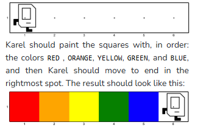

## Question # 5 - Rainbow
Make Karel paint a rainbow! Karel will start in the left corner of a world with 1 row and 6 columns, like so:



### Given Code
```python
"""
File: Rainbow.py
------------------------------
Karel makes a rainbow!
"""

"""
This is a worked example. This code is starter code; you should edit and run it to
solve the problem. You can click the blue show solution button on the left to see
the answer if you get too stuck or want to check your work!

Note: The unit test for this worked example is currently not working. Ignore it!
"""

from karel.stanfordkarel import *

def main():
    """
    You should write your code to make Karel do its task in
    this function. Make sure to delete the 'pass' line before
    starting to write your own code. You should also delete this
    comment and replace it with a better, more descriptive one.
    """
    pass  # Delete this line and write your code here! :)


# There is no need to edit code beyond this point

if __name__ == '__main__':
    main()
```

## Answer
```python
"""
File: Rainbow.py
------------------------------
Karel makes a rainbow!
"""

from karel.stanfordkarel import *

def main():
    """
    Karel paints the squares Red, Orange, Yellow, Green, and Blue in order. Karel ends on an unpainted square in column 6.
    """
    paint_corner('Red')
    move()
    paint_corner('Orange')
    move()
    paint_corner('Yellow')
    move()
    paint_corner('Green')
    move()
    paint_corner('Blue')
    move()


# There is no need to edit code beyond this point

if __name__ == '__main__':
    main()
```