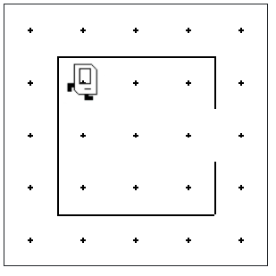

## Your task: Write a program in main.py, that makes Karel pick up a beeper and go back into her house.


Karel starts off in the corner of her house as shown in the world. She needs to collect some food, represented (as all objects in Karel's world are) by a beeper, from outside the doorway and then to return to her initial position. You can assume that every part of the world is always the same. The house is exactly this size, the door is always in the position shown, and the beeper is just outside the door. Thus, all you have to do is write the sequence of commands necessary to have Karel

* Move to the beeper,
* Pick it up, and
* Return to her starting point.

Even though the program is only a few lines, it is still worth getting at least a little practice in decomposition. In your solution, include a function for moving to the package, and returning to the starting point.

When you are finished the world should look like this:



### Answer:
```python
from karel.stanfordkarel import *

# File: shelter.py
# -----------------------------
# The warmup program defines a "main"
# function which should make Karel 
# move to the beeper, pick it up, and
# return home.
from karel.stanfordkarel import *

def main():
    move()          
    move()           
    turn_right()     
    move()
    turn_left()            
    move()    
    pick_beeper()

    # to get back
    turn_left() 
    turn_left()
    move()
    turn_right()
    move()
    turn_left()
    move()
    move()
    turn_left()
    turn_left()

def turn_right():
    turn_left()
    turn_left()
    turn_left()
    
    
# don't edit these next two lines
# they tell python to run your main function
if __name__ == '__main__':
    main()
```