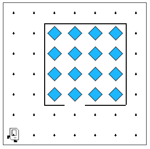

## Assignment
Karel has picked up a new hobby: doing puzzles! Karel is trying to complete this puzzle made up of beepers. When complete the puzzle should look like this:



Karel is almost done but not finished yet. Bellow is the current state of Karel's world. The beeper in the bottom most row represents the last piece of the puzzle! Write a program which will get Karel to pick up the last piece, put it in place, and move Karel back to the bottom left corner of the world facing East so she can admire the completed puzzle.

* To reiterate, you should write the sequence of commands so that Karel will:
* Move to and pick up the last puzzle piece (the beeper in row 1, column 3)
* Put the puzzle piece in place (row 3, column 4)
* Return Karel to her initial position

Although the program does not have many lines of code, it is still worth getting some practice with decomposition. In your solution, include a function for each of the three steps shown in the outline above.

## Answer

```python
from karel.stanfordkarel import *

def main():
    go_pick_beeper()
    place_beeper_in_puzzle()
    return_to_start()

def go_pick_beeper():
    """
    Move Karel to the last puzzle piece at (1,3) and pick it up.
    Starting from (1,1) facing East.
    """
    move()  # from (1,1) to (1,2)
    move()  # from (1,2) to (1,3)
    pick_beeper()

def place_beeper_in_puzzle():
    """
    Move Karel to the position (3,4) to put down the beeper.
    """
    # From (1,3), facing East.
    turn_left()  # now facing North
    move()       # (2,3)
    turn_right() # facing East
    move()       # (3,4)
    turn_left()
    move()
    put_beeper()

def return_to_start():
    """
    Return Karel to the start (1,1), facing East.
    """
    # Karel currently at (3,4), facing East.
    turn_around()  # face West
    move()         # (3,3)
    turn_right()   
    move()         # (2,3)
    move()         # (1,2)
    move()         # (1,1)
    turn_left()
    move()
    turn_left()

# Helper functions to turn right and around
def turn_right():
    for _ in range(3):
        turn_left()

def turn_around():
    for _ in range(2):
        turn_left()

if __name__ == '__main__':
    main()
```