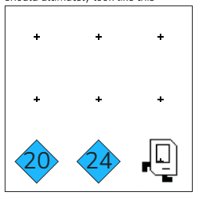

## Assignment
Your  task is to help Karel celebrate the occasion by placing 20 beepers, moving Karel one step, placing 24 beepers, and moving Karel one more step. The world should ultimately look like this:



There are many ways to get this correct. In order to program this well you should be using two for loops. Recall that a for loop looks like this:

```python
for i in range(100):
    # things to repeat
    move()
```

This for loops repeats move 100 times. What do you want to repeat, and how many times?

## Answer: 

```python
from karel.stanfordkarel import *

"""
Karel will place 20 beepers in the current square,
move one step forward, place 24 beepers in that square,
then move one more step forward and stop.
"""

def main():
    place_20_beepers()
    move()
    place_24_beepers()
    move()

def place_20_beepers():
    for i in range(20):
        put_beeper()

def place_24_beepers():
    for i in range(24):
        put_beeper()

if __name__ == '__main__':
    main()
```