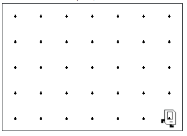

## Assignment
Your task: Write a program in the editor, that makes Karel pick up all the beepers on the first row of this world.



## Answer:
```python
from karel.stanfordkarel import *

# File: piles.py
# -----------------------------
# This program makes Karel pick up all the beepers
# on the first row of the world.

def main():
    while front_is_clear():
        pick_up_beepers()
        move()
    # Pick up any beepers at the last corner (where move isn't possible)
    pick_up_beepers()

def pick_up_beepers():
    while beepers_present():
        pick_beeper()

# don't edit these next two lines
if __name__ == '__main__':
    main()
```