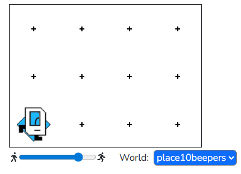

## Question # 01 - Place 10 beepers
Place 10 beepers on the spot Karel is currently standing on.

### Given Code
```python
"""
This is a worked example. This code is starter code; you should edit and run it to 
solve the problem. You can click the blue show solution button on the left to see 
the answer if you get too stuck or want to check your work!
"""

from karel.stanfordkarel import *

def main():
    """
    Places 10 beepers in the spot that Karel is standing.
    """
    pass # Delete this line and write your code here! :)


# There is no need to edit code beyond this point

if __name__ == '__main__':
    main()
```

## Answer
```python
from karel.stanfordkarel import *

def main():
    """
    Places 10 beepers in the spot that Karel is standing.
    """
    # Since we are placing a known number of beepers, we can use a for-loop to repeat put_beeper()
    for i in range(10):
        put_beeper()


# There is no need to edit code beyond this point

if __name__ == '__main__':
    main()
```

### Output
