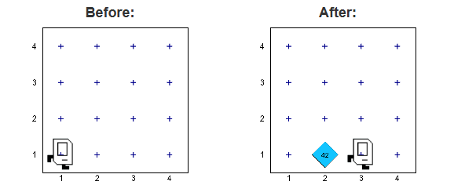

## Chapter 5: For Loops



## Basic For Loop
Since you know that there are exactly 42 beepers to place, the control statement that you need is a **for loop**, which specifies that you want to repeat some operation a fixed number of times. The structure of the for statement appears complicated primarily because it is actually much more powerful than anything Karel needs. The only version of the for syntax that Karel uses is:

```python
for i in range(count):
statements to be repeated
```

## Nested Loops

```python
# File: CornerFiveBeepers.py
# -----------------------------
# Places five beepers in each corner
from karel.stanfordkarel import *
def main():
   # Repeat once for each corner 
   for i in range(4):
      put_five_beepers()
      move_to_next_corner()

# reposition karel to the next corner 
def move_to_next_corner() :
   move()
   move()
   move()
   turn_left()

# places 5 beepers using a for loop 
def put_five_beepers() :
   for i in range(5):
   	put_beeper()
```