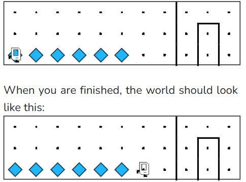

## Assignment
Karel was trying to get back home but got lost! Luckily, they set a path of beepers down as they were traveling earlier. Write a program that makes Karel follow and travel past the end of a straight line of beepers so they can make it home! 

Take note that we don't know how far away Karel's home is and how many beepers there will be, so make sure your solution works for different worlds! You may assume that the row will never be completely filled with beepers.

Here is an example of one world that might show up:



## Answer

```python
from karel.stanfordkarel import *

def main():
    # Move while there are beepers under Karel
    while beepers_present():
        move()

# There is no need to edit code beyond this point

if __name__ == '__main__':
    main()
```