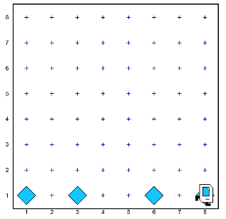
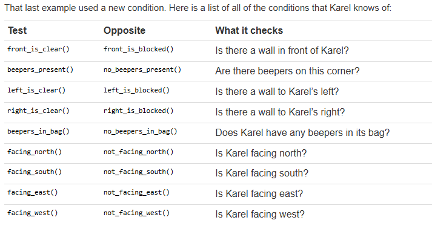

## Chapter 7: If Statements

### Basic Conditionals
An if/else statement executes an "if" code-block if and only if the provided test is true for the state of the world at the time the program reaches the statement. Otherwise the program executes the "else" code-block.

```python
if test:
    if code-block
else:
    else code-block
```

### Example 
```python
from karel.stanfordkarel import *

# the start of the program
def main():
   while front_is_clear(): 
      invert_beeper()
      move()
   # to prevent a fencepost bug 
   invert_beeper()

# picks up a beeper if one is present 
# puts down a beeper otherwise 
def invert_beeper():
   # an if/else statement 
   if beepers_present():
      pick_beeper()
   else:
      put_beeper()
```

### Answer


## Conditions
