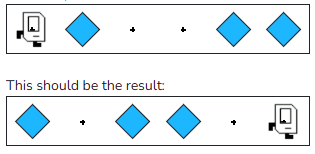
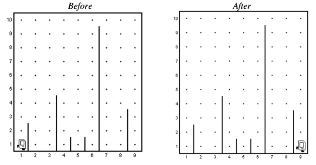

## Question # 01
Karel will be in a single row world with beepers in some positions. Karel should "invert" the pattern of the row -- pick beepers from the spots with beepers and place beepers from the empty spots -- and end facing East in the rightmost position. There will be no more than 1 beeper in each spot. Be sure to invert the positions Karel starts and ends on!

For example, if this is the initial world:



## Answer:
```python
"""
This is a worked example. This code is starter code; you should edit and run it to 
solve the problem. You can click the blue show solution button on the left to see 
the answer if you get too stuck or want to check your work!
"""

from karel.stanfordkarel import *

def main():
    """
    Inverts the pattern of beepers in a single row world.
    """
    
    invert_corner()  # Fencepost problem! This initial invert_corner() fixes it
    while front_is_clear():  # Since we don't know how many squares we need to invert, use a while-loop
        move()
        invert_corner()  # Invert each corner as we move


def invert_corner():
    if beepers_present():
        pick_beeper()
    else:
        put_beeper()


# There is no need to edit code beyond this point

if __name__ == '__main__':
    main()
```

---

## Question # 02
Place 10 beepers in each position in the bottom row. Karel will begin in the bottom left corner of a world with no beepers; Karel should end in the bottom right corner of the world with 10 beepers across the bottom row (including the positions Karel starts and ends on!).

You could start by writing this assuming you know the number of columns (i.e. the length of each row) beforehand, and then tweak your code to make it work for any number of columns!

## Answer
```python
"""
This is a worked example. This code is starter code; you should edit and run it to 
solve the problem. You can click the blue show solution button on the left to see 
the answer if you get too stuck or want to check your work!
"""

from karel.stanfordkarel import *

def main():
    """
    Put 10 beepers in every cell in the bottom row of the world.
    """
    
    put_10_beepers()  # Fencepost bug! This initial put_10_beepers fixes it.
    while front_is_clear():  # Because we don't know when we will run into a wall, we use a while-loop to repeatedly move and put beepers
        move()
        put_10_beepers()

def put_10_beepers():
    """ Helper function to place 10 beepers in Karel's current position. """
    for i in range(10):  # Because we know we want to place exactly 10 beepers, use a for-loop to put_beeper 10 times
        put_beeper()

# There is no need to edit code beyond this point

if __name__ == '__main__':
    main()
```

---
## Question # 03
Fill the entire bottom row of the world with beepers, making sure not to forget to put a beeper on the spots Karel starts / ends on. This tests your understanding of the fencepost problem from lecture.

We've provided 2 worlds for you to use to test your code.

## Answer
```python
"""
This is a worked example. This code is starter code; you should edit and run it to 
solve the problem. You can click the blue show solution button on the left to see 
the answer if you get too stuck or want to check your work!
"""

from karel.stanfordkarel import *

def main():
    """
    Fills entire bottom row of any sized world with beepers.
    """
    
    put_beeper()
  
    # We don't know how large the world is, so we can use a while-loop to move until we reach the last column
    while front_is_clear():
        move()
        put_beeper()


# There is no need to edit code beyond this point

if __name__ == '__main__':
    main()
```

---
## Question # 04
The program that Mehran works through in assignment 2. 

This program allows Karel to run a "Steeple Chase" (like a hurdles race, but with arbitrarily large hurdles) where: 
* Karel starts at position (1, 1), facing East (aka right). 
* The steeple chase is guaranteed to be 9 columns long. 
* There can be arbitrarily many hurdles that can be of arbitrary size, located between any two corners in the world. 
* Karel should "jump" each hurdle one at a time. For example, if you were to execute the SteepleChase program, you would see something like the following before-and-after diagram.



## Answer
```python
"""
File: SteepleChaseKarel.py
--------------------------
Karel runs a steeple chase that is 9 avenues long.
Hurdles are of arbitrary height and placement.
"""

"""
This is a worked example. This code is starter code; you should edit and run it to 
solve the problem. You can click the blue show solution button on the left to see 
the answer if you get too stuck or want to check your work!

Note: The starter code for this example is the solution.
"""

from karel.stanfordkarel import *


def main():
    """
    To run a race that is 9 avenues long, we need to move
    forward or jump hurdles 8 times. Let's use a for-loop for this!
    """
    for i in range(8):
        if front_is_clear():  # If there is no hurdle to jump, move
            move()
        else:  # If there is a hurdle (the front is blocked)
            jump_hurdle()


def jump_hurdle():
    """
    Pre-condition:  Facing East at bottom of hurdle
    Post-condition: Facing East at bottom in next avenue after hurdle
    """
    ascend_hurdle()
    move()
    descend_hurdle()


def ascend_hurdle():
    """
    Pre-condition:  Facing East at bottom of hurdle
    Post-condition: Facing East immediately above hurdle
    """
    turn_left()  # Face North
    
    # While there is a wall on the Eastern side of Karel, move up a row
    while right_is_blocked():
        move()
        
    turn_right()  # Face East


def descend_hurdle():
    """
    Pre-condition:  Facing East above and immediately after hurdle
    Post-condition: Facing East at bottom of hurdle
    """
    turn_right()  # Face South
    move_to_wall()  # Move to row 1
    turn_left()  # Face East


def move_to_wall():
    """
    Pre-condition:  None
    Post-condition: Facing first wall in whichever direction
                    Karel was facing previously
    """
    while front_is_clear():
        move()


def turn_right():
    """
    Pre-condition:  None
    Post-condition: Karel is facing to the right of whichever
                    direction Karel was facing previously
    """
    for i in range(3):
        turn_left()


# There is no need to edit code beyond this point

if __name__ == '__main__':
    main()
```

---
## Question # 05
Make Karel place beepers in a square (4 beepers total) and end in the same position Karel starts in.

## Answer
```python
"""
This is a worked example. This code is starter code; you should edit and run it to 
solve the problem. You can click the blue show solution button on the left to see 
the answer if you get too stuck or want to check your work!
"""

from karel.stanfordkarel import *

def main():
    """
    Makes Karel place beepers in a square (4 beepers total) and end in the same position Karel starts in.
    """
    
    # If we consider the task carefully, we need to repeat several actions
    # Since we are repeating a these actions a known number of times, we use a for-loop
    for i in range(4):
        # Put beeper
        put_beeper()

        # Makes us move in a square motion when we do it four times
        move()
        turn_left()


# There is no need to edit code beyond this point

if __name__ == '__main__':
    main()
```
