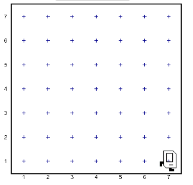
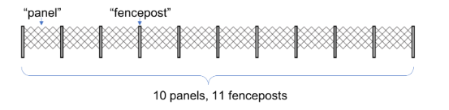
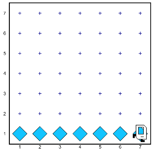

## Chapter 6: While Loops
The technique of defining new functions, and defining for loops—as useful as they are—does not actually enable Karel to solve any new problems. Every time you run a program it always does exactly the same thing. Programs become a lot more useful when they can respond differently to different inputs.

## Example
```python
# File: MoveToWall.py
# ------------------------------
# Uses a "while" loop to move Karel until it hits
# a wall. Works on any sized world.
from karel.stanfordkarel import *

# the program starts with main
def main():
   # call the move to wall function
   move_to_wall()

# this is a very useful function 
def move_to_wall():
   # repeat the body while the condition holds
   while front_is_clear():
      move()
```
## Answer


## Basic While Loop
In Karel, a while loop is used to repeat a body of code as long as a given condition holds. The while loop has the following general form:

```python
while test:
     statements to be repeated
```

The control-flow of a while loop is as follows. When the program hits a while loop it starts repeating a process where it first checks if the test passes, and if so runs the code in the body.

## Fencepost Bug
The bug in the program is an example of a programming problem called a **fencepost error**. 

The name comes from the fact that if you want to build a fence made of panels which have one fence post on either size, the number of fence posts is always one greater than the number of panels. How many fence posts, for example, do you need to build a fence with 10 panels? The answer is 11, as illustrated by the following diagram:



## Example:
```python
# File: BeeperLine.py
# ------------------------------
# Uses a while loop to place a line of beepers.
# This program works for a world of any size.
from karel.stanfordkarel import *

# program starts at main
def main():
   # repeats until karel faces a wall
   while front_is_clear():
      # place a beeper on current square
      put_beeper()
      # move to the next square
      move()
   # solves the fencepost bug
   put_beeper()
```

## Answer:
