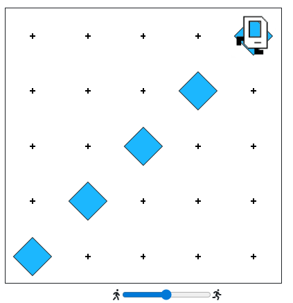
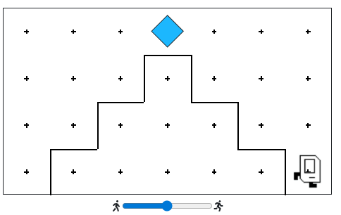
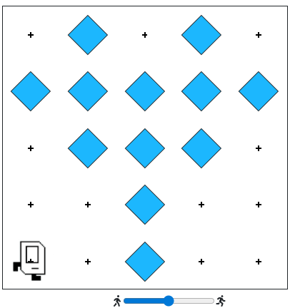
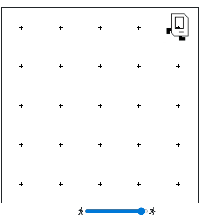

## Example # 01
A warmup example. Makes karel place a diagonal beeper line. Recall how while loops work, and practice stepping up! We are going to use a similar sequence of commands a few times today.

```python
from karel.stanfordkarel import *

# A warmup example. Makes karel place a diagonal
# beeper line. Recall how while loops work, and
# practice stepping up! We are going to use a 
# similar sequence of commands a few times today.

def main():
    # keep stepping up until the top
    while front_is_clear():
        # Assume: Karel is facing right (east) 
        put_beeper()
        turn_left()
        move()
        turn_right()
        move()
    put_beeper()
    
def turn_right():
    # defines turn_right as 3x turn_left
    for i in range(3):
        turn_left()

# This is "boilerplate" code which launches your code
# when you hit the run button
if __name__ == '__main__':
    main()
```

## Result


## Example # 02 - mountain karel example 
```python
from karel.stanfordkarel import *

# The mountain karel example from the video!

def main():
    climb_up_mountain()
    plant_flag()
    climb_down()
    
def climb_up_mountain():
    # post: karel is at the top of the mountain
    # facing east
    while front_is_blocked():
        step_up()
        
def step_up():
    # Karel takes one step up the mountain
    # pre: karel is facing the mountain
    # post: karel is facing the mountain one step up
    turn_left()
    move()
    turn_right()
    move()

def plant_flag():
    # a beeper, the national flag of karel land
    put_beeper()

def climb_down():
    # post: karel is at the bottom of the mountain
    # pre: kare is at the top, facing right
    while front_is_clear():
        step_down()
    
def step_down():
    # pre: karel is on a step, facing right (East)
    # post: karel is on the next step, facing right
    move()
    turn_right()
    move()
    turn_left()


def turn_right():
    # Makes karel turn in the clock-wise direction.
    # Works in any pre-condition state!
    for i in range(3):
        turn_left()


if __name__ == '__main__':
    main()
```

## Result


## Example # 03
Clear the world, row by row. Each time a row is cleared, reset to the start of the row to create a consistent pre/post of the while loop. Left is clear until you are on the top row

```python
from karel.stanfordkarel import *

# Example from the video!

def main():
    """
    Clear the world, row by row. Each time a row is
    cleared, reset to the start of the row to create
    a consistent pre/post of the while loop
    Left is clear until you are on the top row
    """
    while left_is_clear():
        clear_row()
        reset_to_next_row()
    # fencepost problem! One more row to clear
    clear_row()
    
    
    
def clear_row():
    """
    Clear an entire row
    Pre: Karel is facing right (East) at the start of the row
    Post: Karel is at the end of a cleared row, facing right (East)
    """
    while front_is_clear():  # We don't know for sure how large the world may be, so use a while loop!
        clear_corner()  
        move()
    # Fencepost problem! This last clear_corner() fixes it.
    clear_corner()
    
    
def clear_corner():
    """
    Cleans a corner so that there are no beepers on it.
    Pre: The corner Karel is on has 0 or 1 beepers present.
    Post: The corner Karel is on has zero beepers present.
    """
    if beepers_present():
        pick_beeper()
        
        
def reset_to_next_row():
    """
    Pre: Karel is at the end of a row, facing right (East)
    Post: Karel is at the start of the next row, facing right (East)
    """
    turn_around()
    move_to_wall()
    turn_right()
    move()
    turn_right()
    

def move_to_wall():
    while front_is_clear():
        move()
    
    
def turn_right():
    for i in range(3):
        turn_left()
        
        
def turn_around():
    turn_left()
    turn_left()


# This is "boilerplate" code which launches your code
# when you hit the run button
if __name__ == '__main__':
    main()
```

## Result
Start 


End
