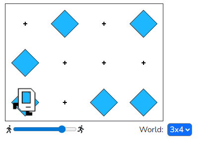
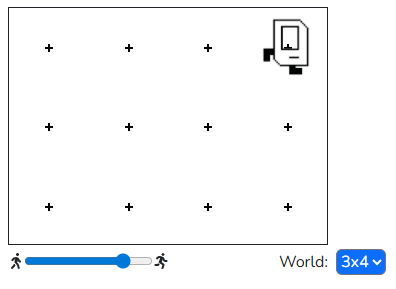
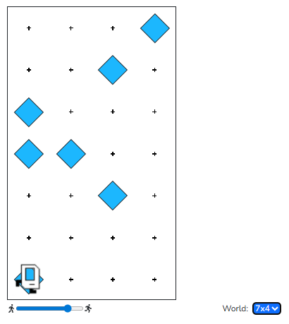
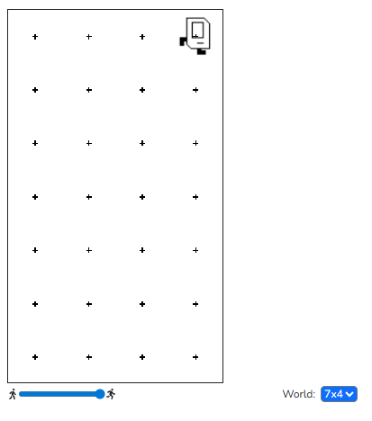

## Question # 06
Karel is so good at cleaning up beepers that they decided to not just clean up one spot, but all of the spots! Lots of beepers have been spread across the world and Karel wants to clean them all up.

## Answer
```python
"""
This is a worked example. This code is starter code; you should edit and run it to 
solve the problem. You can click the blue show solution button on the left to see 
the answer if you get too stuck or want to check your work!

Note: This starter code is a solution, but it's messy! Try decomposing it. If you need help, try looking at some of the comments for ideas on what to decompose.
"""

from karel.stanfordkarel import *

def main():
    # If we aren't at the top row (we use a while loop because we don't know how many rows there are)
    while left_is_clear():
        ### Pick up a row of beepers ###
        while front_is_clear():
            # Pick up a beeper if present
            if beepers_present():
                pick_beeper()
            move()
            
        if beepers_present():
            pick_beeper()
        
        ### Move back to the first column ###
        # Turn around
        for i in range(2):
            turn_left()
        
        # Move to wall
        while front_is_clear():
            move()
        
        ### Move up to the next row ###
        # Turn right
        for i in range(3):
            turn_left()
        move()
        
        ### Reset Karel for loop pre-conditions by turning right to face East ###
        for i in range(3):
            turn_left()
    
    ### Pick up the final row of beepers ###
    while front_is_clear():
        # Pick up a beeper if present
        if beepers_present():
            pick_beeper()
        move()
    
    if beepers_present():
        pick_beeper()
        

# There is no need to edit code beyond this point

if __name__ == '__main__':
    main()
```

## Result

### 3x4
### Start


### End


### 7x4
### Start


### End
