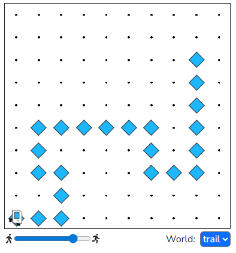
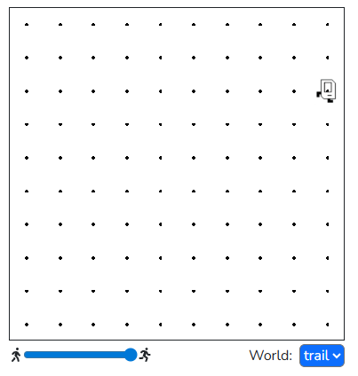

## Question # 07
Karel starts off in a world where there is a mysterious trail of beepers. Karel starts off standing on a beeper. Help Karel follow the trail of beepers (picking up beepers as she goes) until the end! We guarantee that the trail will never lead Karel to a spot that is adjacent to a wall. In the world we've provided, we expect Karel to end up in the third cell down from the top right corner, facing East.

## Answer
```python
"""
This is a worked example. This code is starter code; you should edit and run it to 
solve the problem. You can click the blue show solution button on the left to see 
the answer if you get too stuck or want to check your work!
"""

from karel.stanfordkarel import *

def main():
    """
    You should write your code to make Karel do its task in
    this function. Make sure to delete the 'pass' line before
    starting to write your own code. You should also delete this
    comment and replace it with a better, more descriptive one.
    """
    
    while beepers_present():
        follow_straight_trail()
        step_backwards()
        # Check left
        turn_left()
        move()
        if no_beepers_present():
            # Trail doesn't continue to the left;
            # Go right
            step_backwards()
            turn_around()
            move()
            # Here the next iteration of the loop will check if there is a beeper; if there is we will keep going and if not we will stop!
    
def follow_straight_trail():
    while beepers_present():
        pick_beeper()
        move()

def step_backwards():
    """
    Turn around and go back one step, 
    then face the same way you were when you started
    """
    turn_around()
    move()
    turn_around()

def turn_around():
    turn_left()
    turn_left()

# There is no need to edit code beyond this point

if __name__ == '__main__':
    main()
```

## Result

### Start


### End
