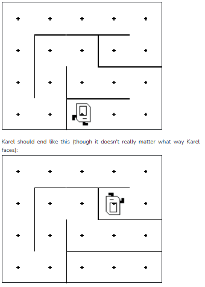

## Question # 04
According to Wikipedia, "maze refers to a complex branching multicursal puzzle with choices of path and direction, while a unicursal labyrinth has only a single path to the center. A labyrinth in this sense has an unambiguous route to the center and back and presents no navigational challenge."

We've designed a labyrinth Karel world -- Karel will start in one dead end, and so long as Karel moves forwards through the labyrinth, Karel will eventually end up at the other dead end. For example, if Karel starts like this:



Write a program which will allow Karel to solve any labyrinth. Karel will always start facing the open direction.

## Answer:
```python
"""
This is a worked example. This code is starter code; you should edit and run it to 
solve the problem. You can click the blue show solution button on the left to see 
the answer if you get too stuck or want to check your work!
"""

from karel.stanfordkarel import *

def main():
    """
    You should write your code to make Karel do its task in
    this function. Make sure to delete the 'pass' line before
    starting to write your own code. You should also delete this
    comment and replace it with a better, more descriptive one!
    """
    
    # Solves labyrinth.
    while front_is_clear():  # Move until there is nowhere to go (see what find_direction() does!)
        move_to_wall()
        find_direction()

def find_direction():
    """
    Turns Karel to the unblocked direction, if an unblocked direction exists. 
    If both left and right are blocked, Karel will not turn.
    
    Pre: There is a wall in front of Karel.
    Post: Karel has turned into an unblocked direction if one exists.
    """

    if left_is_clear():
        turn_left()
    if right_is_clear():
        turn_right()

def turn_right():
    for i in range(3):
        turn_left()

def move_to_wall():
    while front_is_clear():
        move()

# There is no need to edit code beyond this point

if __name__ == '__main__':
    main()
```