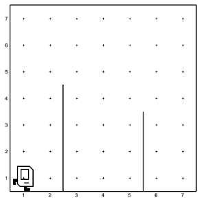
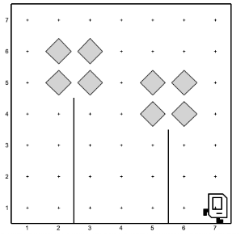

## Question # 08
For this problem, Karel will start in a world with exactly 2 flower stems, like so:



Since it's springtime, Karel will make the "flowers" bloom! Each flower is comprised of four beepers and goes directly on top of each stem, so that the end result for this world looks like this (note that Karel should end up in the bottom right corner):



Some important notes:
* There will always be exactly 2 stems, but
* they may not always be the same distance apart, though they will be spaced so that you will always be able to bloom flowers without the blooms overlapping.
* The stems may be of any height, but they will be short enough that you can bloom an entire flower without walking off of the top edge of the world.
* Karel will always start in the bottom left corner of the world, and Karel should always end in the bottom right corner of the world.

## Answer
```python
"""
This is a worked example. This code is starter code; you should edit and run it to 
solve the problem. You can click the blue show solution button on the left to see 
the answer if you get too stuck or want to check your work!
"""

from karel.stanfordkarel import *

def main():
    """
    Karel starts in the bottom left corner of a world with 2 empty flower stems, facing East.
    Karel should bloom both flowers with beepers and end in the bottom right corner of the world facing East.
    """
    
    # Karel makes springtime happen by blooming both flower stems in the world!
    for i in range(2):  # We know there will be exactly two stems, so we can use a for-loop to bloom them!
        move_to_wall()  # Move to the next stem
        bloom_flower()
    move_to_wall()  # Fencepost problem! This fixes it. :)

def bloom_flower():
    """
    Karel places a bloom on top of the stem she is facing.

    Pre: Karel is on row 1 to the immediate left of a stem facing East.
    Post: Karel is on row 1 to the immediate right of a stem facing East.
    """
    climb_stem()
    make_bloom()
    move_to_wall()
    turn_left()

def climb_stem():
    """
    Karel climbs the stem until the top, at the bottom left corner of where the bloom will go.

    Pre: Karel is at the base of the stem facing East.
    Post: Karel is at the bottom left corner of the bloom facing North.
    """
    turn_left()
    while right_is_blocked():
        move()

def make_bloom():
    """
    Karel makes the flower bloom with beepers!

    Pre: Karel is on the bottom left corner of the bloom facing North
    Post: Karel is on the bottom right corner of the bloom facing South
    """
    # Makes a square of beepers
    put_beeper()
    move()
    for i in range(2):
        put_beeper()
        turn_right()
        move()
    put_beeper()

def move_to_wall():
    # Karel moves until blocked.
    while front_is_clear():
        move()

def turn_right():
    turn_left()
    turn_left()
    turn_left()


# There is no need to edit code beyond this point

if __name__ == '__main__':
    main()
```