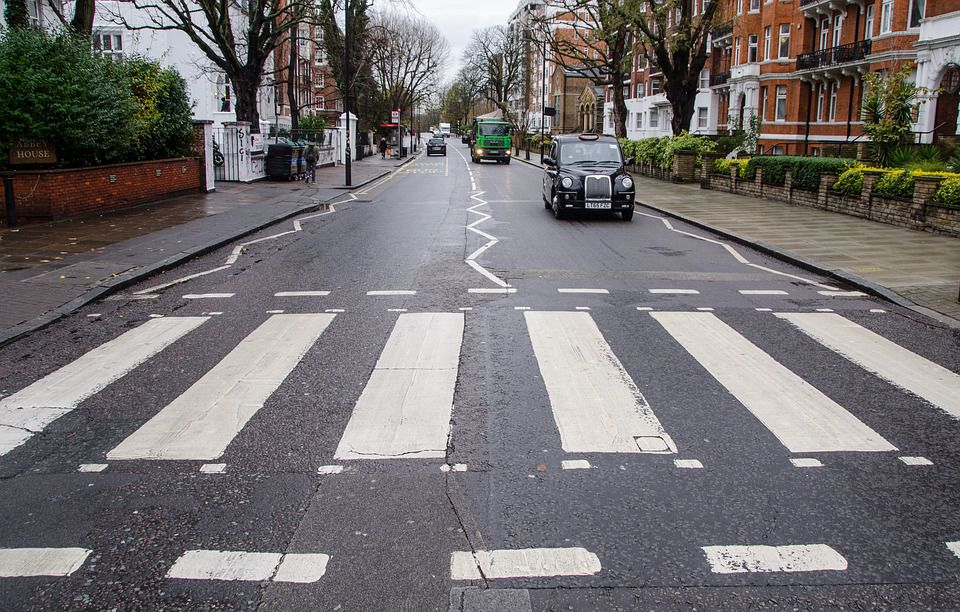
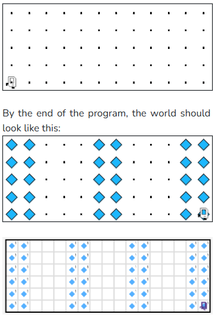

## Question # 05
A Zebra crossing, or crosswalk, is a series of black and white stripes across a road indicating where a pedestrian can cross (seen below).



In the interests of road safety, Karel has been asked to make Zebra crossings. In the world of Karel, a Zebra crossing is defined as a pattern beginning with a 2-square wide column of beepers, followed by repeating pairs of a 3-square wide gap and a 2-square wide column of beepers. 

For example, Karel might begin its job in this world:


## Answer
```python
"""
This is a worked example. This code is starter code; you should edit and run it to 
solve the problem. You can click the blue show solution button on the left to see 
the answer if you get too stuck or want to check your work!
"""

from karel.stanfordkarel import *

def turn_right():
    turn_left()
    turn_left()
    turn_left()

def beeper_column():
    """
    Places one column of beepers.
    
    Pre: Karel is either:
           - On row 1 facing North or,
           - On the top-most row facing South
    Post: If Karel started on row 1, they are now on the top-most row facing North.
          If Karel started on the top-most row they are now on row 1 facing South.
    """
    put_beeper()  # Fencepost problem! This initial put_beeper() fixes it.
    while front_is_clear():  # We don't know how tall the column is, so use a while-loop to travel it
        move()
        put_beeper()

def draw_stripe():
    """
    Draws a two-column stripe as described in the prompt.
    
    Pre: Karel is on row 1 facing East.
    Post: Karel is on row 1 facing East, one column over.
    """

    # Place the stripe's first column of beepers.
    turn_left()  # Face North for beeper_column()'s pre-condition
    beeper_column()

    # Move to the next column
    turn_right()
    move()

    # Place the stripe's second column of beepers
    turn_right()  # Face South for beeper_column's pre-condition
    beeper_column()
    turn_left()  # Face East

def main():
    """
    You should write your code to make Karel do its task in
    this function. Make sure to delete the 'pass' line before
    starting to write your own code. You should also delete this
    comment and replace it with a better, more descriptive one!
    """
    
    draw_stripe()
    while front_is_clear():  # We don't know exactly how many stripes we will need, so use a while-loop.
        for i in range(4):  # We know that there are 3 squares between each stripe, so use a for-loop to go to the next stripe's starting location.
            move()
        draw_stripe()  # This while-loop assumes Karel starts and ends drawing a stripe facing East on row 1!


# There is no need to edit code beyond this point

if __name__ == '__main__':
    main()
```

